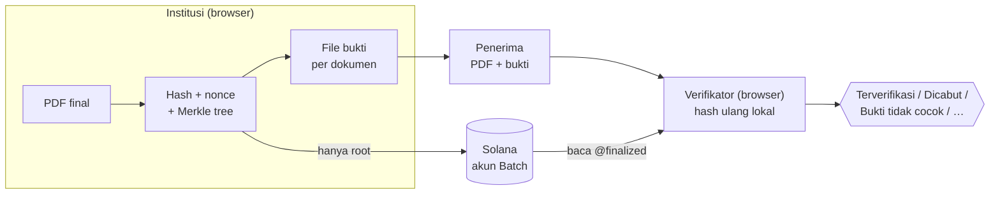
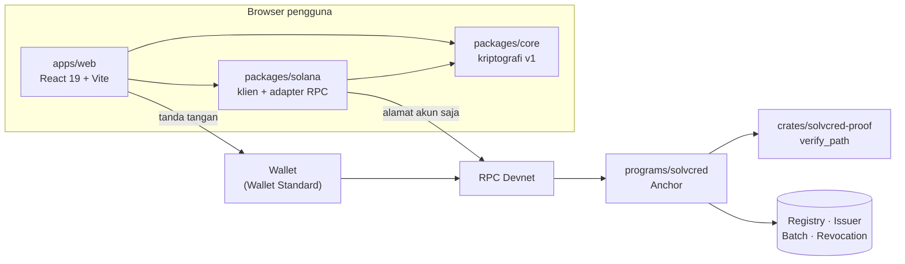

<div align="center">

# SolVcred

**Kredensial digital yang dapat diverifikasi siapa pun, tanpa akun, tanpa wallet, dan tanpa mengunggah dokumen.**

Satu Merkle root di Solana mewakili satu batch hingga 100 ijazah atau sertifikat. PDF tetap di tangan pemiliknya.

[](https://github.com/BangkitTheGreat/solvcred/actions/workflows/ci.yml)


[Cara kerja](#cara-kerja) · [Mulai cepat](#mulai-cepat) · [Arsitektur](#arsitektur) · [Keamanan](#keamanan-dan-privasi) · [Dokumentasi](#dokumentasi)

</div>

---

> [!IMPORTANT]
> **Status: MVP lulus CI, belum di-deploy ke Devnet.** Kelima kelompok kerja (proof Rust, program Anchor, test on-chain, adapter
> RPC, UI) lulus CI, termasuk build SBF dan **22/22 test on-chain** di validator lokal. `scripts/deploy-devnet.sh` sudah digladi di
> validator lokal. Program ID di source masih placeholder tanpa private key. Semua data di aplikasi adalah **data simulasi**.
> Bukti lengkap: [validasi](docs/validation.md) · [keterlacakan kebutuhan](docs/requirements-traceability.md).

## Masalah

Verifikasi ijazah masih bergantung pada email ke kampus, portal yang berbeda-beda, atau mata yang memeriksa PDF. PDF mudah diubah
tanpa jejak. HR tidak punya cara mandiri untuk membedakan dokumen asli, dokumen yang diedit, dan dokumen yang sudah dicabut
penerbitnya.

## Solusi

| | Yang dilakukan SolVcred |
| --- | --- |
| 🔒 **Dokumen tetap privat** | Hashing, Merkle tree, dan verifikasi berjalan di browser. PDF, nonce, dan proof tidak pernah dikirim ke server atau RPC |
| 🧾 **Satu transaksi, 100 kredensial** | Satu Merkle root per batch. Rent batch di Devnet ±0,0015 SOL, atau ±0,000015 SOL per kredensial |
| 🙋 **Verifikasi tanpa akun** | Verifikator cukup memilih PDF + file bukti. Tidak perlu wallet, login, atau menghubungi institusi |
| 🛑 **Fail-closed** | Galat atau timeout RPC selalu **Belum dapat diverifikasi**, tidak pernah dianggap "tidak dicabut" |
| 🔁 **Kunci bisa diganti** | Rotasi dua tanda tangan dan pemulihan oleh admin. Batch lama tetap terverifikasi |
| ⛔ **Pencabutan permanen** | Program memverifikasi keanggotaan Merkle on-chain sebelum mencatat pencabutan |

## Cara kerja



1. **Admin registry** memeriksa institusi di luar aplikasi, lalu mendaftarkannya on-chain.
2. **Penerbit** memilih ≤ 100 PDF. Browser membuat nonce acak, leaf, Merkle tree, dan file bukti, lalu **wajib** mengunduh cadangan draft sebelum menerbitkan.
3. Wallet penerbit mengirim `publish_batch`, berisi **hanya** batch ID, root, dan jumlah dokumen.
4. **Penerima** menyimpan pasangan `nama.pdf` + `nama.proof.json` dan membagikannya.
5. **Verifikator** memilih kedua file. Browser menghitung ulang hash, lalu membaca issuer, batch, dan status pencabutan dalam satu snapshot `finalized`.

## Tujuh status verifikasi

| Status | Artinya |
| --- | --- |
| ✅ **Terverifikasi** | Integritas cocok dengan root on-chain, penerbit aktif, tidak ada pencabutan |
| ⛔ **Dicabut** | Penerbit mencatat pencabutan permanen |
| ✖ **Bukti tidak cocok** | PDF atau file bukti berubah (termasuk dipindai atau diekspor ulang) |
| ⚠ **Penerbit belum dipercaya** | Penerbit tidak ada di registry |
| ⏸ **Penerbit nonaktif** | Cocok, tetapi penerbit dinonaktifkan admin |
| 🔍 **Batch tidak ditemukan** | Jaringan terbaca, batch tidak ada |
| ❔ **Belum dapat diverifikasi** | RPC gagal, jaringan salah, atau versi bukti tidak didukung. Bukan sah maupun tidak sah |

Urutan pemeriksaan lengkap ada di [system design §8.3](docs/system-design.md#83-verifikasi).

## Mulai cepat

### TypeScript: core, klien, dan UI

Butuh Node.js ≥ 22.23 dan npm. Python ≥ 3.10 hanya untuk fixture independen.

```sh
npm ci --ignore-scripts
npm run check                                  # typecheck (root + web) + 52 unit test
python3 scripts/reference_vectors.py --check   # referensi Python independen
npm run web:dev                                # UI di http://localhost:5173
```

| Perintah | Hasil |
| --- | --- |
| `npm run web:build` | Bundle statis ke `dist/web` (bisa di-host di path mana pun) |
| `npm run demo` | Tiga PDF fiktif + file bukti + manifest draft di `work/demo-<batch-id>/`. Tanpa wallet atau transaksi |
| `npm run benchmark` | Hashing 100 payload 1 MiB (hanya byte lokal, bukan browser atau RPC) |

### Rust dan program Anchor

Linux atau WSL2, dengan Rust 1.89, Solana CLI (Agave) 2.3.x, dan Anchor CLI **0.32.1**.

```sh
cargo test --workspace --locked          # crate proof (test vector v1) + unit test program
solana-keygen new --no-bip39-passphrase  # wallet lokal jika belum ada
anchor build && anchor keys sync         # ganti placeholder dengan program ID keypair lokal
anchor test                              # validator lokal → deploy upgradeable → 22 test on-chain
```

> [!WARNING]
> `anchor keys sync` mengubah `declare_id!` dan `Anchor.toml`. Jangan commit program ID lokal sebagai program ID produksi.

### Deploy ke Devnet

```sh
scripts/deploy-devnet.sh --cluster localnet --authority <keypair>          # gladi di solana-test-validator
scripts/deploy-devnet.sh --program-keypair <file> --authority <keypair>   # Devnet (butuh ±5,1 SOL Devnet)
npm run registry -- status --url <rpc> --program-id <id>                 # status program + registry
```

Skrip mem-build, men-deploy atau meng-upgrade, lalu menjalankan `initialize_registry`. Skrip aman dijalankan ulang. Keputusan
kunci admin, biaya, dan pemulihan ada di [deploy-devnet.md](docs/deploy-devnet.md). Operasi setelah deploy (hosting, onboarding
penerbit, uji penerimaan, runbook insiden) ada di [deployment.md](docs/deployment.md).

### Konfigurasi UI

Salin `apps/web/.env.example` menjadi `apps/web/.env.local`, atau jalankan skrip deploy dengan `--write-env`.

| Variabel | Default | Keterangan |
| --- | --- | --- |
| `VITE_SOLVCRED_PROGRAM_ID` | placeholder | Program ID hasil deploy. UI menampilkan banner selama nilainya placeholder |
| `VITE_SOLVCRED_RPC_URL` | `https://api.devnet.solana.com` | Harus `https`. Proof tidak pernah memilih endpoint |
| `VITE_SOLVCRED_GENESIS_HASH` | genesis Devnet | Menolak RPC yang terhubung ke jaringan lain |

Aturan validasi dan catatan RPC kustom: [deployment.md §1](docs/deployment.md#1-konfigurasi-frontend).

## Arsitektur

**Klien tebal, rantai tipis.** Rantai hanya menyimpan fakta yang butuh konsensus publik: siapa yang dipercaya, root apa yang
terbit, dan leaf mana yang dicabut. Tidak ada backend, database, atau analytics.



| Komponen | Lokasi | Tanggung jawab |
| --- | --- | --- |
| UI | [`apps/web`](apps/web) | Tiga tab (Verifikasi, Penerbit, Admin registry), gerbang cadangan draft, paket ZIP, alur dua wallet |
| Klien program | [`packages/solana`](packages/solana) | Builder instruksi, decoder akun ketat, PDA, `verifyCredential`, `checkPublishedBatch` (FR-10) |
| Inti kriptografi | [`packages/core`](packages/core) | Draft batch, leaf/Merkle v1, parser proof. Tanpa dependensi runtime, tanpa jaringan |
| Kembaran Rust | [`crates/solvcred-proof`](crates/solvcred-proof) | Encoding dan `verify_path` identik dengan core, `no_std` |
| Program on-chain | [`programs/solvcred`](programs/solvcred) | 7 instruksi atas 4 jenis akun: registry, otorisasi, immutability, pencabutan terverifikasi |

<details>
<summary><b>Tujuh instruksi program</b></summary>

| Instruksi | Penanda tangan | Efek |
| --- | --- | --- |
| `initialize_registry` | Upgrade authority | Membuat registry; penanda tangan menjadi admin permanen |
| `register_issuer` | Admin | Mendaftarkan institusi (issuer ID stabil, `key_version = 1`) |
| `publish_batch` | Authority issuer (aktif) | Membuat akun Batch immutable berisi root |
| `revoke_credential` | Authority issuer | Memverifikasi path Merkle, lalu membuat akun Revocation permanen |
| `deactivate_issuer` | Admin | Menghentikan penerbitan baru (tidak dapat dibatalkan) |
| `rotate_authority` | Kunci lama + kunci baru | Mengganti authority, `key_version + 1` |
| `recover_authority` | Admin + kunci baru | Pemulihan saat kunci hilang atau dicuri |

Layout akun, seeds PDA, discriminator, dan kode error: [program-interface.md](docs/program-interface.md).

</details>

Diagram lengkap (C4, sequence, state machine, deployment) ada di [architecture.md](docs/architecture.md). Alasan di balik setiap
keputusan ada di [14 ADR](docs/decisions.md).

### Diagram interaktif

Lima diagram Archify di [`docs/diagrams/`](docs/diagrams) dilengkapi pan/zoom, pencarian, tema terang/gelap, dan ekspor.
**Buka file HTML-nya secara lokal di browser.** GitHub tidak merender HTML.

| Diagram | Menjawab |
| --- | --- |
| [system-architecture.html](docs/diagrams/system-architecture.html) | Komponen dan batas kepercayaan |
| [publish-batch.html](docs/diagrams/publish-batch.html) | Publikasi batch dan pemulihan saat respons terputus (FR-10) |
| [proof-dataflow.html](docs/diagrams/proof-dataflow.html) | Data apa yang tetap privat dan apa yang menjadi publik |
| [verify-credential.html](docs/diagrams/verify-credential.html) | Jalan dari PDF + bukti ke tujuh status |
| [credential-lifecycle.html](docs/diagrams/credential-lifecycle.html) | Draft → diterbitkan → dicabut |

## Keamanan dan privasi

- **Konfigurasi menentukan kepercayaan, bukan file.** RPC, program ID, dan jaringan berasal dari build. Proof tidak pernah memilihnya.
- **Satu snapshot `finalized`.** Program, issuer, batch, dan revocation dibaca dalam satu panggilan dari slot yang sama, lalu divalidasi owner, ukuran, discriminator, dan relasinya.
- **Leaf terikat konteks.** Preimage 179 byte mengikat program, issuer, batch, indeks, jumlah leaf, nonce acak, dan hash PDF, dengan pemisahan domain leaf/node.
- **Bootstrap tidak bisa direbut.** Hanya upgrade authority program yang dapat menginisialisasi registry.
- **Tiga implementasi, satu kebenaran.** TypeScript, Rust, dan referensi Python independen harus menghasilkan byte yang sama (`test-vectors/v1.json`).
- **Tanpa private key di aplikasi.** Semua penandatanganan lewat wallet.

Model ancaman lengkap: [threat-model.md](docs/threat-model.md). Detail privasi per pengamat: [system design §11](docs/system-design.md#11-privasi).

## Pengujian

| Lapisan | Jumlah | Jalankan |
| --- | --- | --- |
| Core TypeScript | 25 | `npm test` |
| Klien Solana (RPC palsu tingkat HTTP) | 27 | `npm test` |
| Crate Rust + unit program | 25 | `cargo test --workspace --locked` |
| On-chain (validator lokal) | 22 | `anchor test` |
| Referensi Python independen | 3 fixture | `python3 scripts/reference_vectors.py --check` |

CI ([`ci.yml`](.github/workflows/ci.yml)) menjalankan job `typescript` dan `rust`, lalu `anchor` (build SBF, `anchor keys sync`,
`anchor test`). Strategi test: [development.md §4](docs/development.md#4-strategi-pengujian).

## Struktur repo

```text
apps/web/                React + Vite: verifikasi, penerbit, admin
packages/core/           Core TypeScript tanpa dependensi runtime
packages/solana/         Klien program dan adapter RPC (@solana/web3.js)
crates/solvcred-proof/   Implementasi Rust format proof v1
programs/solvcred/       Program Anchor
tests/program/           Uji on-chain, dijalankan oleh `anchor test`
test-vectors/v1.json     Fixture deterministik untuk TypeScript dan Rust
scripts/                 Referensi Python, demo, benchmark, deploy Devnet, CLI registry
deployments/             Catatan deployment Devnet (dibuat skrip deploy)
docs/                    Dokumentasi dan diagram interaktif
.github/workflows/       CI TypeScript, Rust, dan Anchor localnet
```

## Dokumentasi

Mulai dari **[pusat dokumentasi](docs/README.md)**, yang memuat jalur baca per peran.

| Untuk | Baca |
| --- | --- |
| Memahami produk | [PRD](docs/PRD.md) · [Keterlacakan kebutuhan](docs/requirements-traceability.md) · [Roadmap](docs/roadmap.md) |
| Memahami desain | [System design](docs/system-design.md) · [Arsitektur](docs/architecture.md) · [Keputusan (ADR)](docs/decisions.md) · [Glosarium](docs/glossary.md) |
| Menulis kode | [Panduan pengembangan](docs/development.md) · [Referensi API](docs/api-reference.md) · [Antarmuka program](docs/program-interface.md) · [Format proof v1](docs/proof-format-v1.md) |
| Keamanan | [Model ancaman](docs/threat-model.md) · [Validasi](docs/validation.md) |
| Operasi | [Deployment Devnet](docs/deploy-devnet.md) · [Operasi dan runbook](docs/deployment.md) |
| Pengguna akhir | [Panduan pengguna](docs/user-guide.md) |

## Roadmap

- [x] Spesifikasi proof v1, core TypeScript, dan referensi Python
- [x] Crate Rust dengan test vector yang sama
- [x] Program Anchor, 22 test on-chain, dan cek drift IDL ↔ klien
- [x] Adapter RPC fail-closed dan UI tiga peran
- [x] Skrip deploy Devnet dan CLI registry (digladi di localnet)
- [ ] Deploy Devnet dan uji end-to-end dengan wallet sungguhan
- [ ] Benchmark browser, audit aksesibilitas, dan data demo

Detail: [roadmap.md](docs/roadmap.md). Target 5.000 dokumen per batch membutuhkan skema v2 ([system design §12](docs/system-design.md#12-skalabilitas-dan-batas)).

## Batas jaminan

SolVcred **tidak** membuktikan kebenaran klaim akademik, kejujuran institusi, atau identitas orang yang membawa file. Memegang PDF
dan file bukti bukan bukti identitas. Root tidak dapat memulihkan PDF atau file bukti yang hilang. Mengekspor ulang atau memindai
PDF mengubah hash-nya. Admin registry, operator RPC, hosting frontend, dan pemegang upgrade authority adalah pihak yang dipercaya.
Selama program masih dapat di-upgrade, immutability batch juga bergantung pada pengelolaan upgrade authority. Keterbatasan lain,
termasuk batch dari kunci curian yang tidak dapat dicabut secara proaktif, tercatat di
[system design §16](docs/system-design.md#16-keterbatasan-dan-pertanyaan-terbuka).

---

<div align="center">

Repo kanonis: [BangkitTheGreat/solvcred](https://github.com/BangkitTheGreat/solvcred) · Lisensi belum ditetapkan

</div>
