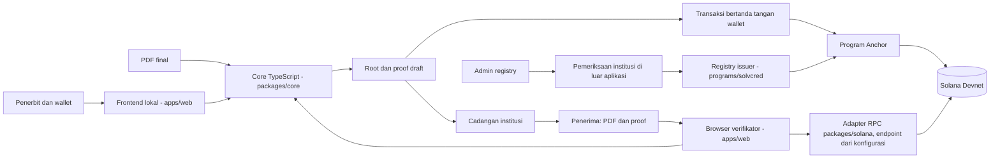
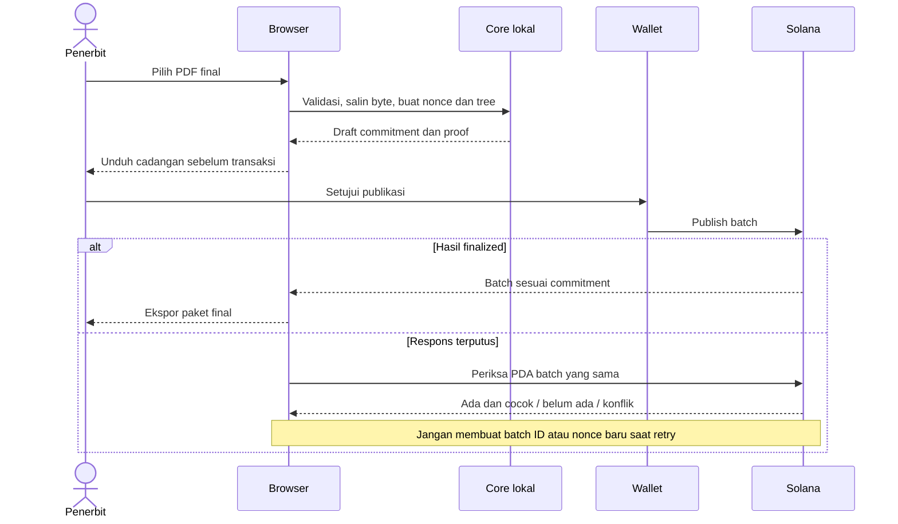
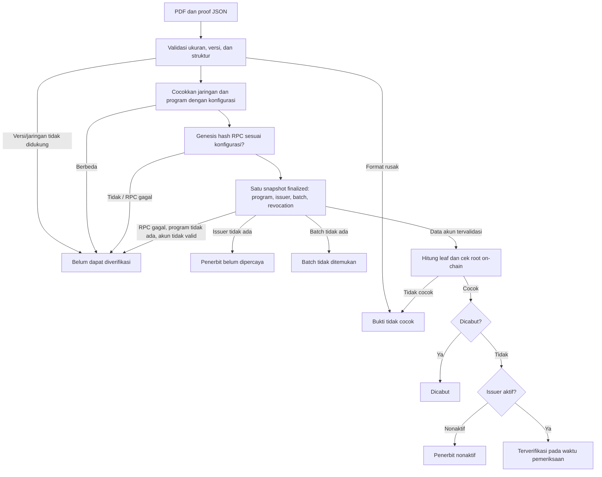
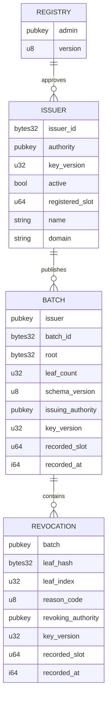
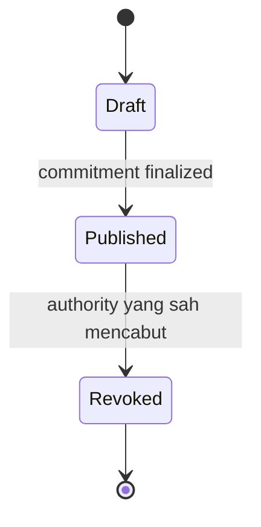

# Arsitektur dan diagram SolVcred

Diagram berikut menggambarkan komponen yang sudah ditulis. Program Anchor dan uji on-chain baru diverifikasi setelah CI Linux berjalan; lihat `docs/validation.md`. GitHub dapat merender blok Mermaid langsung.

## 1. Batas kepercayaan

Dokumen, nama file, nonce, dan proof lengkap tidak dikirim ke RPC. Publikasi hanya mengirim commitment. Pencabutan mengirim leaf hash, indeks, dan jalur Merkle yang diperlukan program, bukan PDF atau nonce. Pembacaan status hanya mengirim alamat akun, tetapi alamat PDA revocation tetap memberi tahu RPC kredensial mana yang sedang diperiksa. Metadata pencabutan tetap dapat dikorelasikan. Registry admin dan upgrade authority adalah batas kepercayaan eksplisit.

## 2. Penerbitan dan pemulihan

Status `draft` dari core selalu berarti belum diterbitkan. UI hanya menyediakan paket final setelah transaksi dikonfirmasi `finalized`, atau setelah `checkPublishedBatch` menemukan batch dengan root dan jumlah leaf yang sama. UI mewajibkan unduhan cadangan draft sebelum tombol publikasi aktif, dan cadangan itu dapat dimuat ulang untuk melanjutkan publikasi yang hasilnya belum jelas. Root saja tidak dapat memulihkan proof.

## 3. Verifikasi

Core hanya menjalankan validasi dan pemeriksaan integritas dengan commitment yang diberikan pemanggil. `integrity-match` bukan status `Terverifikasi`. Adapter `verifyCredential` membangun commitment tepercaya hanya dari konfigurasi dan akun on-chain, tidak pernah dari file proof.

Adapter memvalidasi status program (executable, owner BPF Upgradeable Loader), owner setiap akun, ukuran tetap, discriminator, dan relasi antarakun: issuer ID, batch → issuer, dan revocation → batch serta leaf. Seluruh akun dibaca dalam satu `getMultipleAccounts` dengan commitment `finalized`, sehingga semuanya berasal dari slot yang sama. Timeout tidak pernah diartikan sebagai akun pencabutan tidak ada.

## 4. Relasi akun

PDA: registry `["registry"]`, issuer `["issuer", issuer_id]`, batch `["batch", issuer_account, batch_id]`, revocation `["revoked", batch_account, leaf_hash]`. Ukuran, discriminator, urutan akun, dan kode error ada di [program-interface.md](program-interface.md).

`initialize_registry` hanya dapat dipanggil oleh upgrade authority program saat itu. Penonaktifan melarang publikasi baru; pencabutan tetap dapat dilakukan oleh authority issuer yang berlaku. Rotasi normal memerlukan tanda tangan kunci lama dan baru. Pemulihan oleh admin adalah kewenangan terpisah yang juga memerlukan tanda tangan kunci baru.

## 5. Status kredensial dan kunci

Pencabutan tidak dapat dibatalkan. Koreksi menerbitkan kredensial baru. Status issuer dan versi kunci merupakan sumbu terpisah: mengganti kunci tidak mengubah batch lama atau otomatis mencabut kredensialnya.
