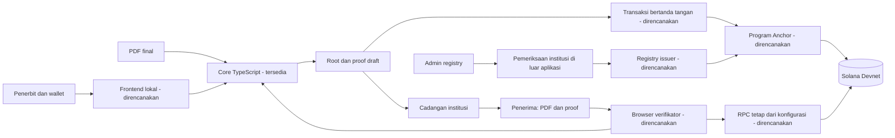
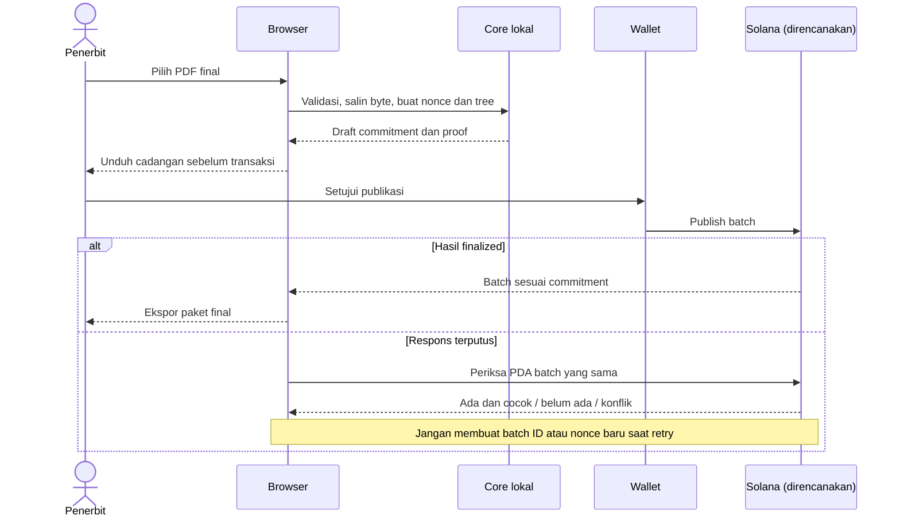
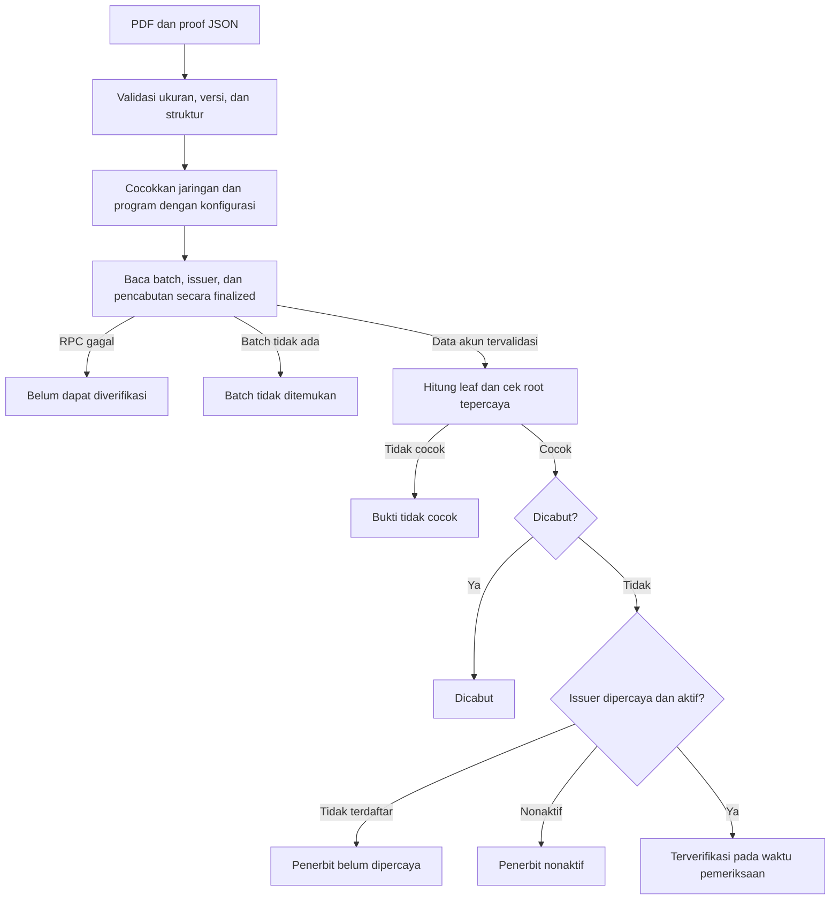
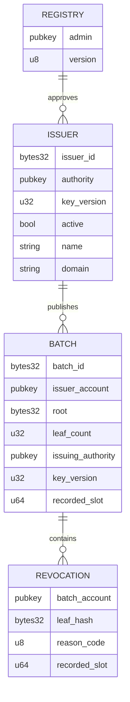
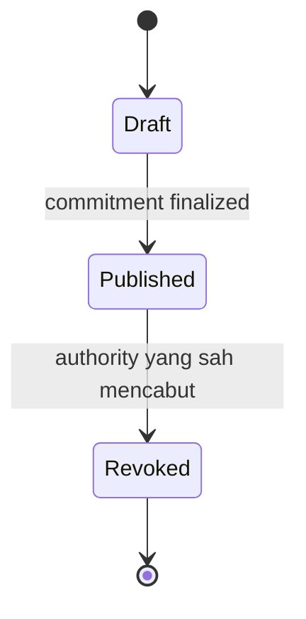

# Arsitektur dan diagram SolVcred

Diagram berikut membedakan komponen yang sudah diimplementasikan dan integrasi yang masih direncanakan. GitHub dapat merender blok Mermaid langsung.

## 1. Batas kepercayaan

Dokumen, nama file, nonce, dan proof lengkap tidak dikirim ke RPC. Publikasi hanya mengirim commitment; pencabutan nantinya mengirim leaf hash dan jalur Merkle yang diperlukan program, bukan PDF atau nonce. Metadata pencabutan tetap dapat dikorelasikan. Registry admin dan upgrade authority adalah batas kepercayaan eksplisit.

## 2. Penerbitan dan pemulihan

Status `draft` dari core selalu berarti belum diterbitkan. Hanya integrasi transaksi yang telah memeriksa hasil finalized dapat menyebut paket sebagai final. Salinan draft harus disimpan utuh; root saja tidak dapat memulihkan proof.

## 3. Verifikasi

Core saat ini hanya menjalankan validasi dan pemeriksaan integritas dengan commitment yang diberikan pemanggil. `integrity-match` bukan status `Terverifikasi`. Mengambil expected root dari file proof itu sendiri hanya membuktikan konsistensi internal.

Adapter RPC mendatang wajib memvalidasi program owner, discriminator, PDA dan hubungan akun. Baca seluruh akun terkait dalam satu respons snapshot jika memungkinkan. Jangan mengartikan timeout sebagai akun pencabutan tidak ada.

## 4. Relasi akun yang direncanakan

PDA rencana: registry `["registry"]`, issuer `["issuer", issuer_id]`, batch `["batch", issuer_pubkey, batch_id]`, revocation `["revoked", batch_pubkey, leaf_hash]`. Ukuran dan constraint Anchor belum diimplementasikan. Penonaktifan melarang publikasi baru; pencabutan tetap dapat dilakukan oleh authority issuer yang berlaku. Rotasi normal memerlukan kunci lama dan baru; pemulihan administratif merupakan kewenangan terpisah.

## 5. Status kredensial dan kunci

Pencabutan tidak dapat dibatalkan. Koreksi menerbitkan kredensial baru. Status issuer dan versi kunci merupakan sumbu terpisah: mengganti kunci tidak mengubah batch lama atau otomatis mencabut kredensialnya.
