# Arsitektur SolVcred

> Peta struktural sistem dari luar ke dalam: konteks (C4 level 1), kontainer (level 2), komponen (level 3), lalu batas
> kepercayaan, model akun, alur, dan state. Alasan di balik bentuk ini ada di [system-design.md](system-design.md) dan
> [decisions.md](decisions.md).

Status bukti: seluruh komponen di bawah ada di commit `e529885`. CI run
[`36417904485`](https://github.com/BangkitTheGreat/solvcred/actions/runs/36417904485) lulus, termasuk build SBF program Anchor dan
22 test on-chain di validator lokal. Program belum di-deploy ke Devnet. GitHub merender blok Mermaid langsung; versi interaktif
setiap diagram utama ada di [`diagrams/`](README.md#diagram-interaktif).

## Daftar isi

1. [Konteks sistem](#1-konteks-sistem)
2. [Kontainer](#2-kontainer)
3. [Komponen dan dependensi modul](#3-komponen-dan-dependensi-modul)
4. [Batas kepercayaan](#4-batas-kepercayaan)
5. [Relasi akun](#5-relasi-akun)
6. [Penerbitan dan pemulihan](#6-penerbitan-dan-pemulihan)
7. [Verifikasi](#7-verifikasi)
8. [State kredensial, issuer, dan publikasi](#8-state-kredensial-issuer-dan-publikasi)
9. [Tampilan deployment](#9-tampilan-deployment)

## 1. Konteks sistem

Empat peran manusia berinteraksi dengan satu sistem. Hanya admin dan penerbit yang membutuhkan wallet.

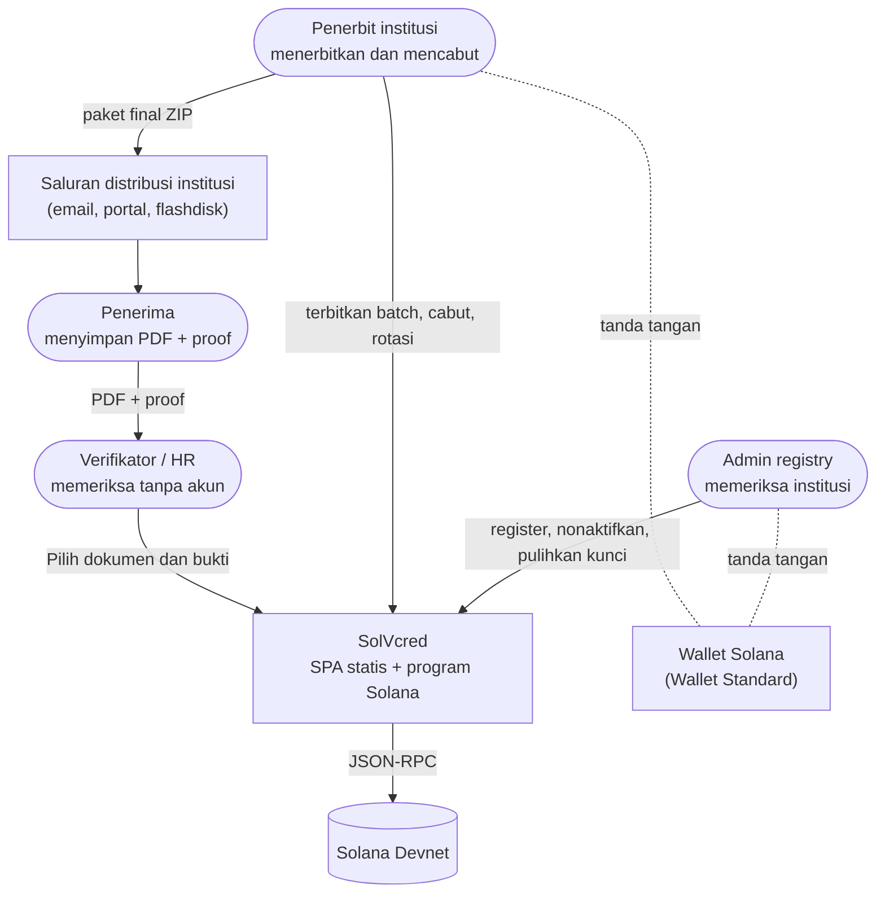
```mermaid
flowchart TB
  Admin(["Admin registry<br/>memeriksa institusi"])
  Issuer(["Penerbit institusi<br/>menerbitkan dan mencabut"])
  Holder(["Penerima<br/>menyimpan PDF + proof"])
  Verifier(["Verifikator / HR<br/>memeriksa tanpa akun"])
  System["SolVcred<br/>SPA statis + program Solana"]
  Wallet["Wallet Solana<br/>(Wallet Standard)"]
  Chain[("Solana Devnet")]
  Channel["Saluran distribusi institusi<br/>(email, portal, flashdisk)"]

  Admin -- "register, nonaktifkan, pulihkan kunci" --> System
  Issuer -- "terbitkan batch, cabut, rotasi" --> System
  Admin -.-|tanda tangan| Wallet
  Issuer -.-|tanda tangan| Wallet
  Issuer -- "paket final ZIP" --> Channel --> Holder
  Holder -- "PDF + proof" --> Verifier
  Verifier -- "Pilih dokumen dan bukti" --> System
  System -- "JSON-RPC" --> Chain
```

Sistem tidak menyimpan atau mengirim dokumen. Distribusi paket final memakai saluran yang sudah dimiliki institusi.

## 2. Kontainer

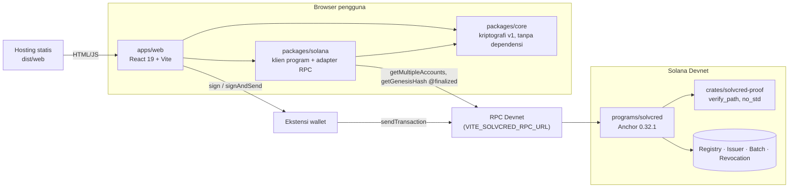
```mermaid
flowchart LR
  subgraph Browser["Browser pengguna"]
    SPA["apps/web<br/>React 19 + Vite"]
    Solana["packages/solana<br/>klien program + adapter RPC"]
    Core["packages/core<br/>kriptografi v1, tanpa dependensi"]
    SPA --> Solana --> Core
    SPA --> Core
  end
  Wallet["Ekstensi wallet"]
  Host["Hosting statis<br/>dist/web"]
  RPC["RPC Devnet<br/>(VITE_SOLVCRED_RPC_URL)"]
  subgraph Chain["Solana Devnet"]
    Program["programs/solvcred<br/>Anchor 0.32.1"]
    Proof["crates/solvcred-proof<br/>verify_path, no_std"]
    Accounts[("Registry · Issuer · Batch · Revocation")]
    Program --> Proof
    Program --> Accounts
  end
  Host -- "HTML/JS" --> SPA
  SPA -- "sign / signAndSend" --> Wallet
  Solana -- "getMultipleAccounts, getGenesisHash @finalized" --> RPC
  Wallet -- "sendTransaction" --> RPC
  RPC --> Program
```

| Kontainer | Teknologi | Tanggung jawab | Tidak pernah |
| --- | --- | --- | --- |
| `apps/web` | React 19, Vite 8, wallet-adapter, fflate | UI tiga peran, gerbang cadangan draft, paket ZIP, alur dua wallet | Mengirim PDF/proof, menyimpan private key, merender file |
| `packages/solana` | `@solana/web3.js` 1.99 | Builder instruksi, decoder ketat, PDA, verifikasi status fail-closed | Menerima RPC atau program dari proof |
| `packages/core` | TypeScript murni + Web Crypto | Draft batch, leaf/Merkle v1, parser proof, cek integritas | Memanggil jaringan |
| `programs/solvcred` | Rust, Anchor 0.32.1 | Registry, otorisasi, immutability batch, verifikasi keanggotaan | Menyimpan data pribadi |
| `crates/solvcred-proof` | Rust `no_std` | Encoding dan `verify_path` identik dengan core | Mengalokasikan memori on-chain |

## 3. Komponen dan dependensi modul

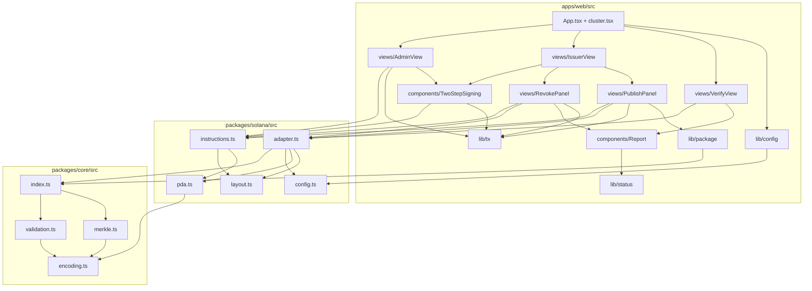
```mermaid
flowchart TB
  subgraph Web["apps/web/src"]
    App["App.tsx + cluster.tsx"]
    VV["views/VerifyView"]
    IV["views/IssuerView"]
    PP["views/PublishPanel"]
    RP["views/RevokePanel"]
    AV["views/AdminView"]
    TS["components/TwoStepSigning"]
    Rep["components/Report"]
    Cfg["lib/config"]
    Tx["lib/tx"]
    Pkg["lib/package"]
    St["lib/status"]
  end
  subgraph Sol["packages/solana/src"]
    Ad["adapter.ts"]
    Ix["instructions.ts"]
    Lay["layout.ts"]
    Pda["pda.ts"]
    Conf["config.ts"]
  end
  subgraph Cor["packages/core/src"]
    Idx["index.ts"]
    Mer["merkle.ts"]
    Val["validation.ts"]
    Enc["encoding.ts"]
  end
  App --> Cfg & VV & IV & AV
  IV --> PP & RP & TS
  AV --> TS
  VV --> Rep --> St
  PP --> Pkg & Tx
  RP --> Tx & Rep
  AV --> Tx
  TS --> Tx
  VV & RP & PP --> Ad
  PP & RP & AV & TS --> Ix
  Cfg --> Conf
  Ad --> Lay & Pda & Conf & Idx
  Ix --> Pda & Lay
  Pkg --> Idx
  Idx --> Mer & Val
  Mer & Val & Pda --> Enc
```

Aturan dependensi:

- Core tidak mengimpor apa pun dari luar folder-nya dan tidak memanggil jaringan.
- `packages/solana` adalah satu-satunya jalur menuju RPC untuk pembacaan status. `lib/tx.ts` di web hanya menangani pengiriman dan finalitas transaksi.
- Web mengimpor paket langsung dari source (`../../../../packages/...`). Vite diizinkan membaca root repo lewat `server.fs.allow`.

## 4. Batas kepercayaan

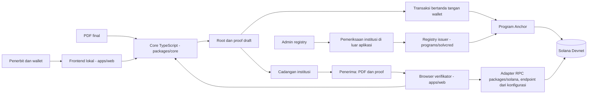
```mermaid
flowchart LR
  Admin[Admin registry] --> Vet[Pemeriksaan institusi di luar aplikasi]
  Vet --> Registry["Registry issuer - programs/solvcred"]
  Issuer[Penerbit dan wallet] --> Browser["Frontend lokal - apps/web"]
  PDF[PDF final] --> Core["Core TypeScript - packages/core"]
  Browser --> Core
  Core --> Draft[Root dan proof draft]
  Draft --> Backup[Cadangan institusi]
  Draft --> Tx[Transaksi bertanda tangan wallet]
  Tx --> Program[Program Anchor]
  Registry --> Program
  Program --> Chain[(Solana Devnet)]
  Backup --> Holder["Penerima: PDF dan proof"]
  Holder --> Verifier["Browser verifikator - apps/web"]
  Verifier --> Core
  Verifier --> RPC["Adapter RPC packages/solana, endpoint dari konfigurasi"]
  RPC --> Chain
```

Dokumen, nama file, nonce, dan proof lengkap tidak dikirim ke RPC. Publikasi hanya mengirim commitment. Pencabutan mengirim leaf
hash, indeks, dan jalur Merkle yang diperlukan program, bukan PDF atau nonce. Pembacaan status hanya mengirim alamat akun,
tetapi alamat PDA revocation tetap memberi tahu RPC kredensial mana yang sedang diperiksa. Metadata pencabutan tetap dapat
dikorelasikan. Registry admin dan upgrade authority adalah batas kepercayaan eksplisit. Rincian per pengamat ada di
[system-design.md §11](system-design.md#11-privasi).

## 5. Relasi akun

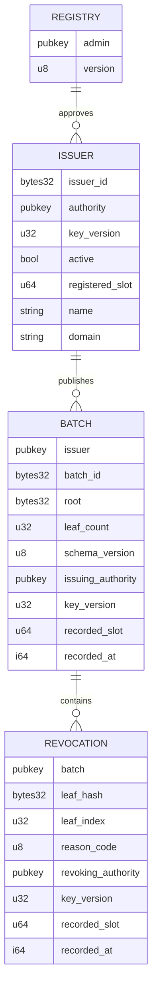
```mermaid
erDiagram
  REGISTRY ||--o{ ISSUER : approves
  ISSUER ||--o{ BATCH : publishes
  BATCH ||--o{ REVOCATION : contains
  REGISTRY {
    pubkey admin
    u8 version
  }
  ISSUER {
    bytes32 issuer_id
    pubkey authority
    u32 key_version
    bool active
    u64 registered_slot
    string name
    string domain
  }
  BATCH {
    pubkey issuer
    bytes32 batch_id
    bytes32 root
    u32 leaf_count
    u8 schema_version
    pubkey issuing_authority
    u32 key_version
    u64 recorded_slot
    i64 recorded_at
  }
  REVOCATION {
    pubkey batch
    bytes32 leaf_hash
    u32 leaf_index
    u8 reason_code
    pubkey revoking_authority
    u32 key_version
    u64 recorded_slot
    i64 recorded_at
  }
```

PDA: registry `["registry"]`, issuer `["issuer", issuer_id]`, batch `["batch", issuer_account, batch_id]`, revocation
`["revoked", batch_account, leaf_hash]`. Ukuran, discriminator, urutan akun, dan kode error ada di
[program-interface.md](program-interface.md).

`initialize_registry` hanya dapat dipanggil oleh upgrade authority program saat itu. Penonaktifan melarang publikasi baru;
pencabutan tetap dapat dilakukan oleh authority issuer yang berlaku. Rotasi normal memerlukan tanda tangan kunci lama dan baru.
Pemulihan oleh admin adalah kewenangan terpisah yang juga memerlukan tanda tangan kunci baru.

## 6. Penerbitan dan pemulihan

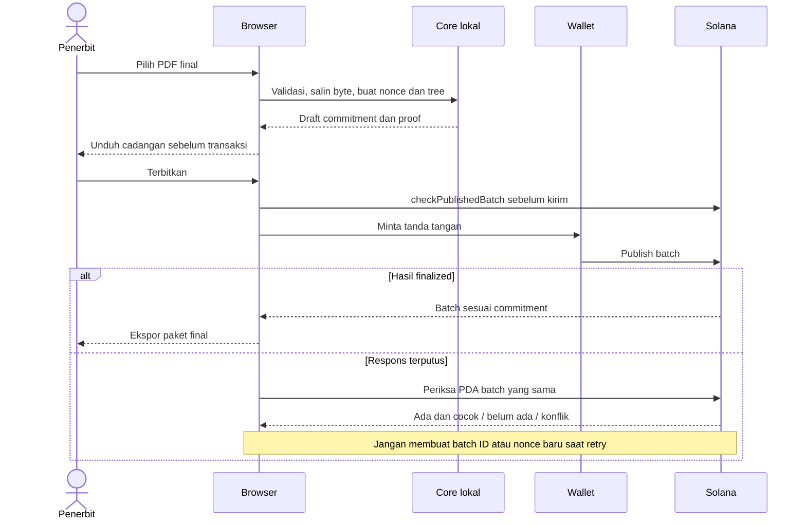
```mermaid
sequenceDiagram
  actor I as Penerbit
  participant B as Browser
  participant C as Core lokal
  participant W as Wallet
  participant S as Solana
  I->>B: Pilih PDF final
  B->>C: Validasi, salin byte, buat nonce dan tree
  C-->>B: Draft commitment dan proof
  B-->>I: Unduh cadangan sebelum transaksi
  I->>B: Terbitkan
  B->>S: checkPublishedBatch sebelum kirim
  B->>W: Minta tanda tangan
  W->>S: Publish batch
  alt Hasil finalized
    S-->>B: Batch sesuai commitment
    B-->>I: Ekspor paket final
  else Respons terputus
    B->>S: Periksa PDA batch yang sama
    S-->>B: Ada dan cocok / belum ada / konflik
    Note over B,S: Jangan membuat batch ID atau nonce baru saat retry
  end
```

Status `draft` dari core selalu berarti belum diterbitkan. UI hanya menyediakan paket final setelah `checkPublishedBatch`
menemukan batch dengan root dan jumlah leaf yang sama pada commitment `finalized`. UI mewajibkan unduhan cadangan draft sebelum
tombol publikasi aktif, dan cadangan itu dapat dimuat ulang untuk melanjutkan publikasi yang hasilnya belum jelas. Root saja
tidak dapat memulihkan proof. Versi lengkap dengan keempat cabang hasil ada di
[system-design.md §8.2](system-design.md#82-publikasi-batch-dan-pemulihan-fr-10).

## 7. Verifikasi

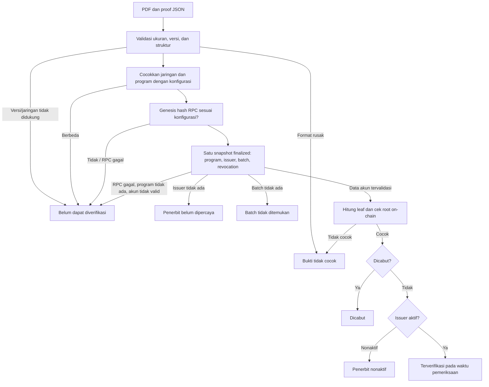
```mermaid
flowchart TD
  Files[PDF dan proof JSON] --> Parse[Validasi ukuran, versi, dan struktur]
  Parse -->|"Versi/jaringan tidak didukung"| Unknown[Belum dapat diverifikasi]
  Parse -->|Format rusak| Invalid[Bukti tidak cocok]
  Parse --> Config[Cocokkan jaringan dan program dengan konfigurasi]
  Config -->|Berbeda| Unknown
  Config --> Genesis[Genesis hash RPC sesuai konfigurasi?]
  Genesis -->|"Tidak / RPC gagal"| Unknown
  Genesis --> Fetch["Satu snapshot finalized: program, issuer, batch, revocation"]
  Fetch -->|"RPC gagal, program tidak ada, akun tidak valid"| Unknown
  Fetch -->|Issuer tidak ada| Untrusted[Penerbit belum dipercaya]
  Fetch -->|Batch tidak ada| Missing[Batch tidak ditemukan]
  Fetch -->|Data akun tervalidasi| Hash[Hitung leaf dan cek root on-chain]
  Hash -->|Tidak cocok| Invalid
  Hash -->|Cocok| Revoke{Dicabut?}
  Revoke -->|Ya| Revoked[Dicabut]
  Revoke -->|Tidak| Trust{Issuer aktif?}
  Trust -->|Nonaktif| Inactive[Penerbit nonaktif]
  Trust -->|Ya| Verified[Terverifikasi pada waktu pemeriksaan]
```

Core hanya menjalankan validasi dan pemeriksaan integritas dengan commitment yang diberikan pemanggil. `integrity-match` bukan
status `Terverifikasi`. Adapter `verifyCredential` membangun commitment tepercaya hanya dari konfigurasi dan akun on-chain, tidak
pernah dari file proof.

Adapter memvalidasi status program (executable, owner BPF Upgradeable Loader), owner setiap akun, ukuran tetap, discriminator,
dan relasi antarakun: issuer ID, batch → issuer, dan revocation → batch serta leaf. Seluruh akun dibaca dalam satu
`getMultipleAccounts` dengan commitment `finalized`, sehingga semuanya berasal dari slot yang sama. Timeout tidak pernah
diartikan sebagai akun pencabutan tidak ada. Urutan pemeriksaan lengkap ada di
[system-design.md §8.3](system-design.md#83-verifikasi).

## 8. State kredensial, issuer, dan publikasi

### 8.1. Kredensial

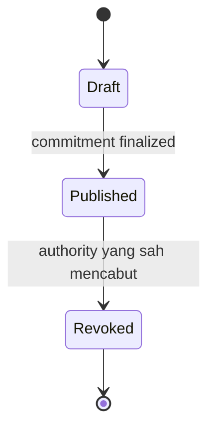
```mermaid
stateDiagram-v2
  [*] --> Draft
  Draft --> Published: commitment finalized
  Published --> Revoked: authority yang sah mencabut
  Revoked --> [*]
```

Pencabutan tidak dapat dibatalkan. Koreksi menerbitkan kredensial baru.

### 8.2. Issuer

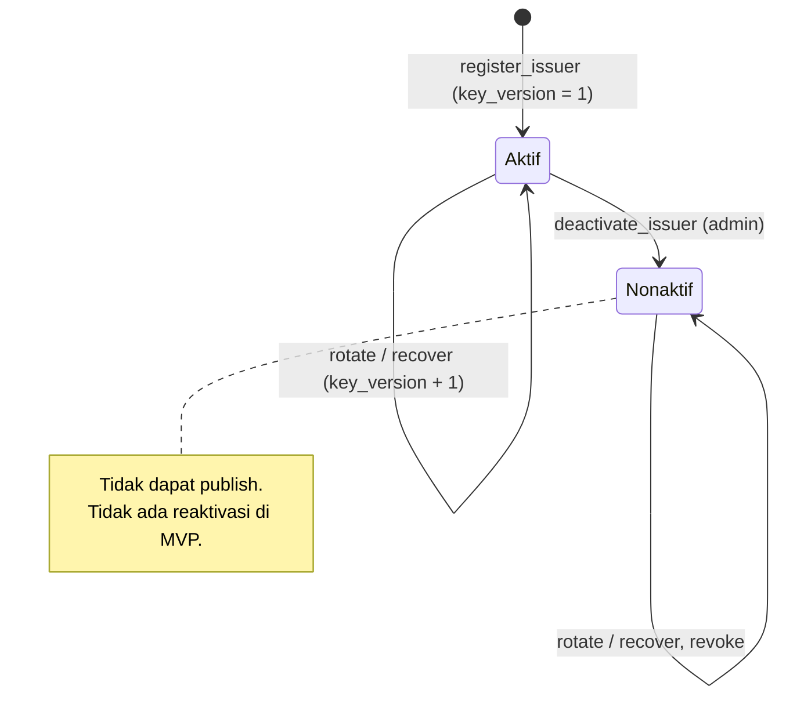
```mermaid
stateDiagram-v2
  [*] --> Aktif: register_issuer (key_version = 1)
  Aktif --> Aktif: rotate / recover (key_version + 1)
  Aktif --> Nonaktif: deactivate_issuer (admin)
  Nonaktif --> Nonaktif: rotate / recover, revoke
  note right of Nonaktif
    Tidak dapat publish.
    Tidak ada reaktivasi di MVP.
  end note
```

Status issuer dan versi kunci merupakan sumbu terpisah dari status kredensial. Mengganti kunci tidak mengubah batch lama atau
otomatis mencabut kredensialnya. Menonaktifkan issuer membuat kredensial lamanya tampil sebagai **Penerbit nonaktif**, bukan
**Terverifikasi**.

### 8.3. Fase publikasi di UI

`PublishPanel` memodelkan publikasi sebagai mesin state eksplisit. Hanya hasil `matches` dari `checkPublishedBatch` yang membuka
paket final.

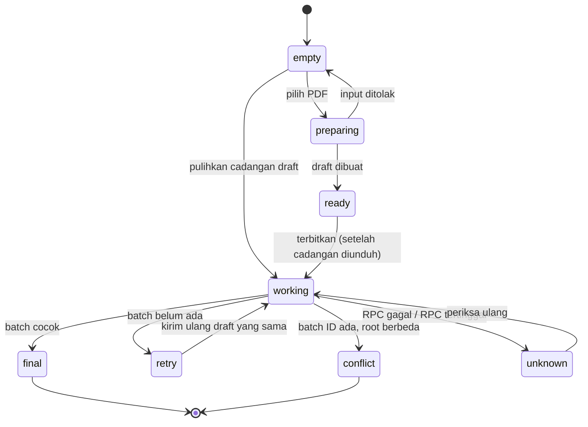
```mermaid
stateDiagram-v2
  [*] --> empty
  empty --> preparing: pilih PDF
  preparing --> ready: draft dibuat
  preparing --> empty: input ditolak
  empty --> working: pulihkan cadangan draft
  ready --> working: terbitkan (setelah cadangan diunduh)
  working --> final: batch cocok
  working --> retry: batch belum ada
  working --> conflict: batch ID ada, root berbeda
  working --> unknown: RPC gagal / RPC tertinggal
  retry --> working: kirim ulang draft yang sama
  unknown --> working: periksa ulang
  final --> [*]
  conflict --> [*]
```

## 9. Tampilan deployment

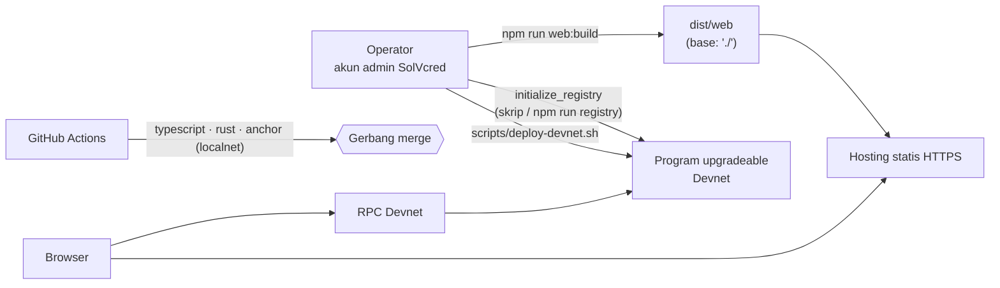
```mermaid
flowchart LR
  Op["Operator<br/>akun admin SolVcred"] -- "scripts/deploy-devnet.sh" --> Prog["Program upgradeable<br/>Devnet"]
  Op -- "initialize_registry<br/>(skrip / npm run registry)" --> Prog
  Op -- "npm run web:build" --> Dist["dist/web<br/>(base: './')"]
  Dist --> Host["Hosting statis HTTPS"]
  User["Browser"] --> Host
  User --> RPC["RPC Devnet"] --> Prog
  GH["GitHub Actions"] -- "typescript · rust · anchor (localnet)" --> Gate{{"Gerbang merge"}}
```

Build web memakai `base: './'`, jadi bundle dapat di-host di path apa pun. Konfigurasi `VITE_SOLVCRED_*` dibekukan ke dalam
bundle saat build. Deploy program dijelaskan di [deploy-devnet.md](deploy-devnet.md); operasi setelahnya di
[deployment.md](deployment.md).
