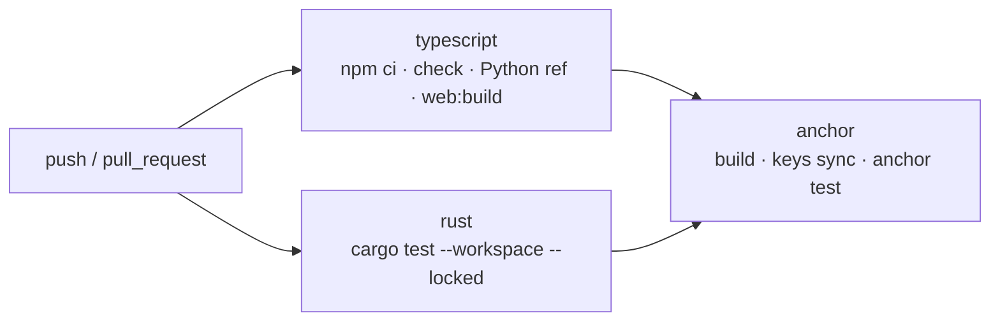

# Panduan pengembangan

> Semua yang dibutuhkan engineer untuk menyiapkan lingkungan, memahami struktur repo, menjalankan test, dan mengubah kode
> tanpa merusak kontrak antara program, crate Rust, dan klien TypeScript.

## Daftar isi

1. [Struktur repo](#1-struktur-repo)
2. [Setup lingkungan](#2-setup-lingkungan)
3. [Perintah harian](#3-perintah-harian)
4. [Strategi pengujian](#4-strategi-pengujian)
5. [Continuous integration](#5-continuous-integration)
6. [Mengubah kontrak dengan aman](#6-mengubah-kontrak-dengan-aman)
7. [Konvensi kode](#7-konvensi-kode)
8. [Pemecahan masalah](#8-pemecahan-masalah)

## 1. Struktur repo

```text
solvcred/
├── apps/web/                 SPA React + Vite (Verifikasi, Penerbit, Admin)
│   └── src/
│       ├── views/            VerifyView, IssuerView, PublishPanel, RevokePanel, AdminView
│       ├── components/       Report, TwoStepSigning, WalletControl, FileSlot, common
│       └── lib/              config, tx, package, status, files, format, validate
├── packages/core/            Kriptografi v1 tanpa dependensi runtime
│   ├── src/                  encoding, merkle, validation, types, index
│   └── test/                 25 unit test
├── packages/solana/          Klien program + adapter RPC (@solana/web3.js)
│   ├── src/                  adapter, instructions, layout, pda, config
│   └── test/                 27 unit test dengan RPC palsu
├── crates/solvcred-proof/    Kembaran Rust dari core (no_std), dipakai program
├── programs/solvcred/        Program Anchor 0.32.1
├── tests/program/            22 test on-chain (validator lokal lewat anchor test)
├── test-vectors/v1.json      Fixture deterministik dari referensi Python
├── scripts/                  reference_vectors.py, demo.ts, benchmark.ts,
│                             deploy-devnet.sh, registry.ts (CLI status/init registry)
├── deployments/              Catatan deployment Devnet (program ID, authority, admin)
├── docs/                     Dokumentasi (mulai dari docs/README.md)
└── .github/workflows/ci.yml  Job typescript, rust, anchor
```

Arah dependensi: `apps/web → packages/solana → packages/core`, dan `programs/solvcred → crates/solvcred-proof`. Web mengimpor
paket langsung dari source dengan path relatif. Tidak ada workspace npm atau langkah build paket terpisah.

## 2. Setup lingkungan

### 2.1. TypeScript (semua platform)

| Alat | Versi |
| --- | --- |
| Node.js | ≥ 22.23 (`engines` di `package.json`; CI memakai 22.23.0) |
| npm | Bawaan Node 22 (npm 10). Lockfile dibuat dengan npm 10 |
| Python | ≥ 3.10, hanya untuk `scripts/reference_vectors.py` |

```bash
npm ci --ignore-scripts
npm run check
python3 scripts/reference_vectors.py --check
```

`--ignore-scripts` mencegah script install dependensi pihak ketiga berjalan.

### 2.2. Rust, Solana, Anchor (Linux atau WSL2)

| Alat | Versi | Pemasangan |
| --- | --- | --- |
| Rust | 1.89.0 | `rustup toolchain install 1.89.0` |
| Solana CLI (Agave) | 2.3.x (CI: 2.3.13) | `sh -c "$(curl -sSfL https://release.anza.xyz/v2.3.13/install)"` |
| Anchor CLI | **0.32.1** | Lewat `avm` (di bawah), atau unduh binary rilis seperti di [deploy-devnet.md](deploy-devnet.md#prasyarat) |

```bash
cargo install --git https://github.com/solana-foundation/anchor avm --force
avm install 0.32.1
avm use 0.32.1
anchor --version
```

`anchor --version` harus menampilkan `0.32.1`. Anchor 0.31.x tidak kompatibel dengan `anchor-lang = "0.32.1"` dan `Anchor.toml`.

Keypair wallet lokal untuk validator:

```bash
solana-keygen new --no-bip39-passphrase
```

## 3. Perintah harian

| Perintah | Fungsi |
| --- | --- |
| `npm run typecheck` | `tsc --noEmit` untuk root (`packages`, `scripts`, `tests`) dan `apps/web` |
| `npm test` | Compile ke `dist/`, lalu `node --test` untuk unit test core dan klien |
| `npm run check` | `typecheck` + `test` |
| `npm run web:dev` | Dev server Vite di `http://localhost:5173` |
| `npm run web:build` | Typecheck web + bundle produksi ke `dist/web` |
| `npm run demo` | Tiga PDF fiktif + proof + manifest draft di `work/demo-<batch-id>/`. Tanpa wallet atau transaksi |
| `npm run benchmark` | Hashing 100 payload 1 MiB (tanpa browser, RPC, atau transaksi) |
| `cargo test --workspace --locked` | Crate proof (unit + vector) dan unit test program (build host), memakai `Cargo.lock` yang di-commit |
| `anchor build` | Build SBF program + IDL di `target/` |
| `anchor keys sync` | Mengganti program ID placeholder dengan keypair lokal |
| `anchor test` | Validator lokal, deploy upgradeable, lalu `npm run test:program` |
| `npm run registry -- status --url <rpc> --program-id <id>` | Status program (upgrade authority, bytecode) dan registry pada `finalized` |
| `scripts/deploy-devnet.sh --cluster localnet --authority <keypair>` | Gladi deploy + bootstrap di `solana-test-validator`. Devnet: lihat [deploy-devnet.md](deploy-devnet.md) |

## 4. Strategi pengujian

| Lapisan | Lokasi | Jumlah | Yang dibuktikan | Cara jalan |
| --- | --- | --- | --- | --- |
| Referensi independen | `scripts/reference_vectors.py` | 3 fixture (1, 3, 5 leaf) | Encoding dan tree dari implementasi ketiga | `python3 scripts/reference_vectors.py --check` |
| Core TS | `packages/core/test/core.test.ts` | 25 | Vector, manipulasi setiap field, node ganjil palsu, batas input, snapshot byte, tanpa jaringan | `npm test` |
| Klien Solana | `packages/solana/test/*.test.ts` | 27 (adapter 17, instruksi 7, layout 3) | Semua status, RPC gagal/timeout, akun palsu, FR-10, encoding instruksi per byte, privasi request | `npm test` |
| Crate Rust | `crates/solvcred-proof` | 17 (6 unit + 11 vector) | Byte identik dengan fixture, manipulasi, kedalaman maksimum | `cargo test --workspace --locked` |
| Program (host) | `programs/solvcred/src/lib.rs` | 8 | Validasi nama/domain, batas, discriminator, offset `memcmp`, kode error | `cargo test --workspace --locked` |
| On-chain | `tests/program/*.test.ts` | 22 | Otorisasi, relasi akun, immutability, lifecycle kunci, siklus penuh lewat adapter, drift IDL | `anchor test` |
| Browser | Manual | – | View tampil, alur wallet dengan wallet palsu, body request | Smoke test (lihat [validation.md](validation.md)) |

Jumlah di atas dihitung ulang pada 28 September 2026 (unit TS dan Rust dijalankan lokal; on-chain dari CI run
[`36417904485`](https://github.com/BangkitTheGreat/solvcred/actions/runs/36417904485)).

Prinsip test:

- **Kasus negatif lebih banyak dari positif.** Hampir setiap test membuktikan sesuatu ditolak.
- **RPC palsu pada level HTTP.** Unit test klien memakai `Connection` web3.js sungguhan dengan `fetch` palsu, sehingga parsing dan timeout ikut diuji.
- **Kode error on-chain diuji eksplisit**, termasuk galat bawaan Anchor (`2006`, `3010`) dan `init` yang gagal.
- **Celah yang diketahui:** `apps/web/src/lib/tx.ts` dan `lib/package.ts` belum punya unit test. Lihat [requirements-traceability.md §7](requirements-traceability.md#7-celah-yang-tercatat).

## 5. Continuous integration

`.github/workflows/ci.yml` berjalan pada setiap push dan pull request, dengan izin `contents: read`.



Job `anchor` membuat wallet dan keypair program sekali pakai, menjalankan `anchor build`, `anchor keys sync`, lalu `anchor test`.
Cache Solana CLI disimpan per versi.

## 6. Mengubah kontrak dengan aman

"Kontrak" berarti apa pun yang harus identik di lebih dari satu tempat. Setiap perubahan di bawah wajib diselesaikan dalam
**satu commit** yang menyentuh semua lokasinya.

| Yang diubah | Ubah juga | Dijaga oleh |
| --- | --- | --- |
| Field akun, urutan, ukuran | `programs/solvcred` (`#[account]`, `assert!` ukuran), `packages/solana/src/layout.ts`, `docs/program-interface.md` | `layout.test.ts`, `00-idl.test.ts`, assert kompilasi |
| Argumen atau urutan akun instruksi | `programs/solvcred`, `packages/solana/src/instructions.ts`, `docs/program-interface.md` | `instructions.test.ts`, `00-idl.test.ts` |
| Kode error baru | Tambahkan di **akhir** enum `SolvcredError`, `PROGRAM_ERRORS`, pesan UI di `apps/web/src/lib/tx.ts`, dokumen | `error_codes_match_the_interface_document`, `00-idl.test.ts` |
| Encoding leaf/node, batas skema | `packages/core`, `crates/solvcred-proof`, `scripts/reference_vectors.py`, `test-vectors/v1.json`, `docs/proof-format-v1.md` **dan versi skema baru** | Test vector di tiga bahasa |
| Seeds PDA | Program, `packages/solana/src/pda.ts`, dokumen | Test on-chain |
| Batas (`LIMITS`, `MAX_LEAVES`) | Core, crate, program, pesan UI di `lib/status.ts`, dokumen | Test batas di setiap lapisan |

Aturan tambahan:

- **Jangan menyisipkan kode error di tengah.** Nomor error adalah bagian dari kontrak klien.
- **Encoding v1 tidak boleh berubah.** Buat `schemaVersion: 2`; parser memeriksa versi sebelum field.
- **Jangan commit program ID lokal** hasil `anchor keys sync` sebagai ID produksi.
- Perbarui [requirements-traceability.md](requirements-traceability.md) jika perubahan memengaruhi FR.

## 7. Konvensi kode

- **TypeScript strict penuh:** `strict`, `noUncheckedIndexedAccess`, `exactOptionalPropertyTypes`, `noUnusedLocals`, `noImplicitOverride`, dan `noEmitOnError`.
- **Data immutable.** Tipe publik memakai `readonly`; konstanta dibekukan dengan `Object.freeze`.
- **Core tanpa dependensi runtime** dan tanpa akses jaringan.
- **Galat bertipe.** `ValidationError` (core), `AccountDataError` (layout), `RpcTimeoutError` (config), `PackageError` dan `FileInputError` (web). Pesan galat tidak pernah memuat isi file atau proof.
- **Bahasa.** Identifier dan komentar kode berbahasa Inggris. Teks yang dilihat pengguna berbahasa Indonesia.
- **Komentar menjelaskan alasan**, bukan mengulang kode (misalnya alasan snapshot sebelum `await`).
- **Rust:** `require!` dengan error bernama; aritmetika versi memakai `checked_add`; `overflow-checks = true` di profil release.
- **Commit:** format `<type>: <deskripsi>` dengan type `feat`, `fix`, `refactor`, `docs`, `test`, `chore`, `perf`, `ci`.

## 8. Pemecahan masalah

| Gejala | Penyebab | Solusi |
| --- | --- | --- |
| `node_modules/.bin/tsc: exec: node.exe: not found` | `node_modules` dipasang di Windows lalu dipakai di Linux/WSL | Hapus `node_modules`, jalankan `npm ci --ignore-scripts` di Linux |
| `npm ci` gagal soal `utf-8-validate` | Lockfile ditulis npm versi lain | Pakai npm 10 (bawaan Node 22) |
| `anchor build` menolak versi | Anchor CLI bukan 0.32.1 | `avm use 0.32.1` |
| `cargo test --locked` gagal karena lockfile perlu diperbarui | Dependensi diubah tanpa memperbarui `Cargo.lock` | Perbarui lockfile secara sengaja (`cargo update -p <crate>`), lalu pastikan job `anchor` tetap lulus. `.cargo/config.toml` memakai resolusi sadar MSRV karena platform-tools Agave 2.3 memakai rustc lebih tua |
| `ANCHOR_PROVIDER_URL is not set; run these tests through anchor test` | `npm run test:program` dijalankan langsung | Jalankan lewat `anchor test` |
| UI: "Program belum di-deploy" | `VITE_SOLVCRED_PROGRAM_ID` kosong (placeholder) | Isi `apps/web/.env.local`, lalu restart dev server |
| UI: "Konfigurasi aplikasi tidak valid" | Nilai `VITE_SOLVCRED_*` tidak lolos validasi | Lihat [deployment.md §1](deployment.md#1-konfigurasi-frontend) |
| Verifikasi selalu "Belum dapat diverifikasi" di lokal | Program tidak ada di RPC yang dikonfigurasi, atau genesis tidak cocok | Arahkan RPC ke validator yang menjalankan program dan set genesis hash-nya |
