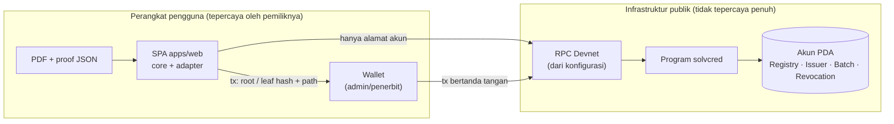
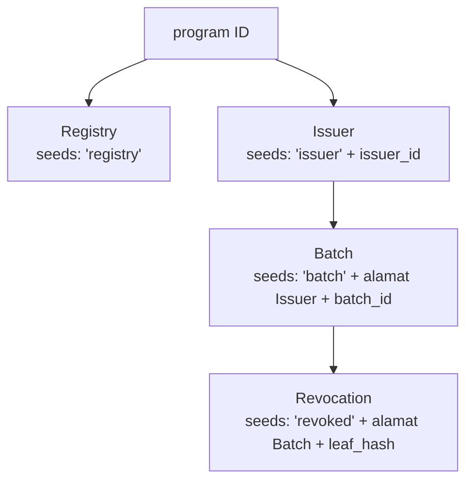
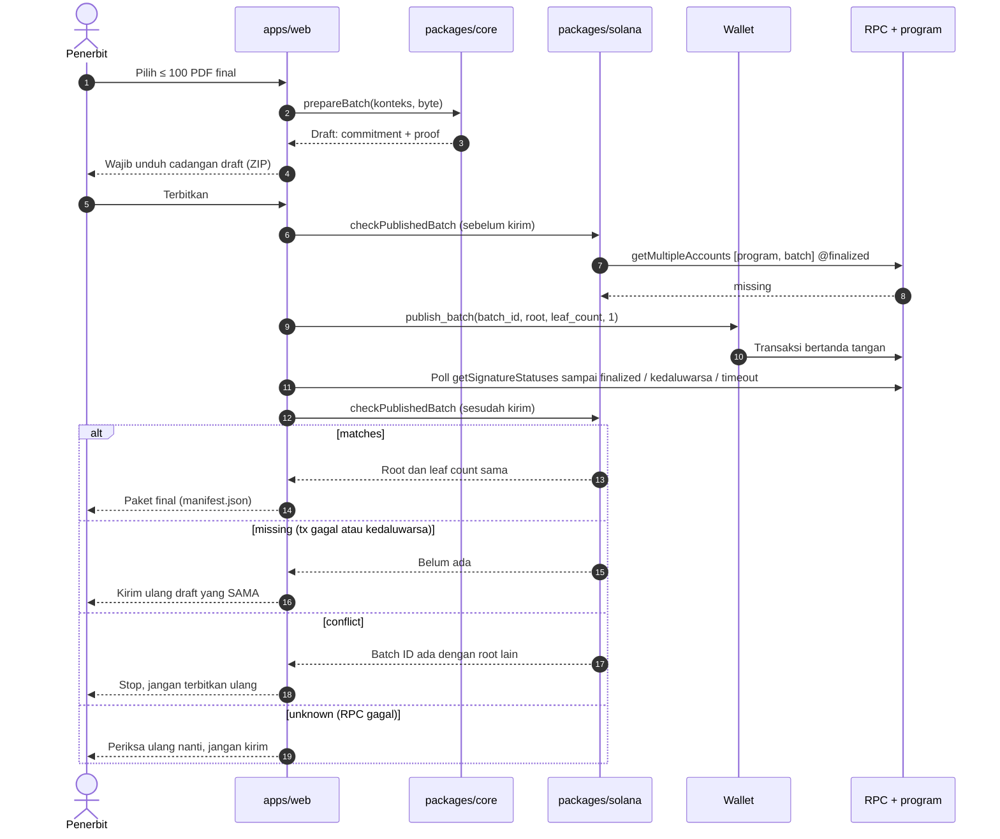
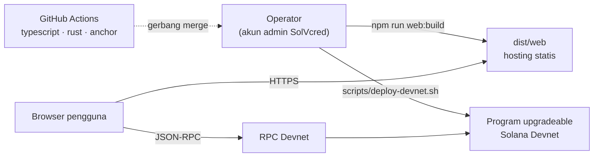

# System Design — SolVcred

> Rancangan sistem end-to-end untuk penerbitan dan verifikasi kredensial digital berbasis Merkle root di Solana.
> Dokumen ini menjelaskan **bagaimana** dan **mengapa** sistem dibangun seperti sekarang. Kontrak biner, encoding hash, dan
> kebutuhan produk tetap punya rumah kanonisnya sendiri; dokumen ini merangkum lalu menautkannya.

| Atribut | Nilai |
| --- | --- |
| Cakupan | MVP, Solana Devnet, data simulasi |
| Versi dokumen | 1.0 (28 September 2026) |
| Kode acuan | commit `e529885` (termasuk skrip deploy Devnet) |
| Status implementasi | Lima kelompok kerja selesai. CI run [`36417904485`](https://github.com/BangkitTheGreat/solvcred/actions/runs/36417904485) lulus di ketiga job, termasuk build SBF dan 22 test on-chain di validator lokal. Program **belum** di-deploy ke Devnet |
| Sumber kebenaran | [PRD](PRD.md) · [Antarmuka program](program-interface.md) · [Format proof v1](proof-format-v1.md) · [Model ancaman](threat-model.md) |

## Daftar isi

1. [Ringkasan](#1-ringkasan)
2. [Konteks, tujuan, dan non-tujuan](#2-konteks-tujuan-dan-non-tujuan)
3. [Kebutuhan](#3-kebutuhan)
4. [Estimasi kapasitas dan biaya](#4-estimasi-kapasitas-dan-biaya)
5. [Arsitektur tingkat tinggi](#5-arsitektur-tingkat-tinggi)
6. [Desain komponen](#6-desain-komponen)
7. [Model data dan identitas](#7-model-data-dan-identitas)
8. [Alur utama](#8-alur-utama)
9. [Konsistensi, keandalan, dan mode kegagalan](#9-konsistensi-keandalan-dan-mode-kegagalan)
10. [Keamanan](#10-keamanan)
11. [Privasi](#11-privasi)
12. [Skalabilitas dan batas](#12-skalabilitas-dan-batas)
13. [Deployment dan operasi](#13-deployment-dan-operasi)
14. [Observabilitas](#14-observabilitas)
15. [Trade-off utama](#15-trade-off-utama)
16. [Keterbatasan dan pertanyaan terbuka](#16-keterbatasan-dan-pertanyaan-terbuka)

---

## 1. Ringkasan

SolVcred memisahkan tiga hal yang biasanya tercampur dalam sistem kredensial: **isi dokumen**, **komitmen kriptografis**, dan
**status kepercayaan**.

- **Isi dokumen** (PDF) tidak pernah meninggalkan tangan institusi dan penerima.
- **Komitmen** berupa satu SHA-256 Merkle root per batch (≤ 100 dokumen), dicatat sekali di akun PDA Solana dan tidak dapat ditimpa.
- **Status kepercayaan** (issuer terdaftar, aktif, kredensial dicabut) dibaca dari akun on-chain pada commitment `finalized`.

Semua komputasi kriptografis berjalan di browser. Tidak ada server aplikasi, database, atau analytics. Sistem hanya bergantung
pada hosting statis, satu endpoint RPC yang dikonfigurasi, dan program Anchor `solvcred`.

## 2. Konteks, tujuan, dan non-tujuan

### 2.1. Masalah

Verifikasi ijazah atau sertifikat masih bergantung pada email ke institusi, portal yang berbeda-beda, atau pemeriksaan visual PDF.
PDF mudah diubah tanpa jejak yang terlihat. Verifikator (HR) tidak memiliki cara mandiri untuk membedakan dokumen asli, dokumen
yang diubah, dan dokumen yang sudah dicabut penerbitnya.

### 2.2. Tujuan desain

| ID | Tujuan | Konsekuensi desain |
| --- | --- | --- |
| G1 | Verifikasi mandiri tanpa akun atau wallet | Verifikasi hanya membaca akun publik; UI verifikasi tidak menyentuh wallet |
| G2 | Dokumen tetap milik pemegangnya | Hashing lokal; on-chain hanya menyimpan root dan leaf hash saat pencabutan |
| G3 | Kegagalan tidak pernah terbaca sebagai "valid" | Status tertutup (*fail-closed*): galat RPC selalu `unverifiable` |
| G4 | Satu transaksi untuk banyak kredensial | Merkle root per batch, bukan akun per kredensial |
| G5 | Rotasi kunci tanpa merusak bukti lama | Issuer ID stabil terpisah dari authority; batch diturunkan dari akun issuer |
| G6 | Tanpa backend yang harus dipercaya | SPA statis; konfigurasi jaringan dibekukan saat build |
| G7 | Dua implementasi, satu kebenaran | TypeScript dan Rust diuji terhadap fixture independen Python yang sama |

### 2.3. Non-tujuan

Sistem tidak membuktikan kebenaran klaim akademik, kejujuran institusi, atau identitas orang yang menunjukkan file. Hal-hal di
luar cakupan MVP (NFT/SBT, ZK selective disclosure, W3C VC/`did:web`, penyimpanan cloud/IPFS, mainnet) tercatat di
[PRD §5.2](PRD.md#52-di-luar-mvp).

## 3. Kebutuhan

### 3.1. Fungsional

FR-01 sampai FR-11 didefinisikan di [PRD §7](PRD.md#7-kebutuhan-fungsional). Pemetaan setiap FR ke kode, test, dan status
ada di [Keterlacakan kebutuhan](requirements-traceability.md).

### 3.2. Non-fungsional

| Atribut | Target | Mekanisme |
| --- | --- | --- |
| Integritas | Perubahan satu byte PDF, nonce, indeks, atau konteks menggagalkan verifikasi | Leaf SHA-256 179 byte dengan pemisahan domain; path Merkle berurutan, bukan diurutkan |
| Otorisasi | Mutasi tanpa hak ditolak walaupun UI dilewati | Constraint Anchor (`has_one`, seeds + bump tersimpan, signer) |
| Kebenaran status | Tidak ada status positif dari data parsial | Satu snapshot `getMultipleAccountsInfoAndContext` pada `finalized` |
| Keamanan jaringan | RPC salah jaringan atau akun palsu tidak dipakai | Cek genesis hash, owner, ukuran, discriminator, relasi antarakun |
| Privasi | PDF, nonce, proof tidak dikirim ke RPC/analytics | Body request hanya berisi alamat akun (diuji) |
| Idempotensi | Retry publikasi tidak membuat batch ganda | PDA batch deterministik + `init`; retry memakai draft yang sama |
| Portabilitas | Proof cukup untuk menemukan batch tanpa database | Proof memuat program ID, issuer ID, batch ID; alamat diturunkan ulang |
| Batas sumber daya | Input tidak dapat menghabiskan memori | 100 PDF, 10 MiB/PDF, 100 MiB/batch, proof 16 KiB, path ≤ 7 |
| Aksesibilitas | Status tidak disampaikan dengan warna saja | Teks + ikon, skip link, tab ARIA, pesan `aria-live` |
| Ketersediaan | Tanpa server aplikasi untuk dipelihara | SPA statis; ketersediaan bergantung pada hosting dan RPC |

## 4. Estimasi kapasitas dan biaya

### 4.1. Akun on-chain

Ukuran akun tetap (lihat [program-interface.md](program-interface.md#akun)). Rent-exempt minimum di bawah ini diambil dari
`solana rent <bytes> -ud` pada 28 September 2026. Parameter rent dapat berubah; ulangi perintah itu sebelum membuat anggaran.

| Akun | Byte | Rent-exempt (Devnet) | Dibayar oleh | Jumlah |
| --- | --- | --- | --- | --- |
| Registry | 42 | 0,0008636 SOL | Admin (upgrade authority) | 1 per deployment |
| Issuer | 254 | 0,00194056 SOL | Admin registry | 1 per institusi |
| Batch | 162 | 0,0014732 SOL | Authority issuer | 1 per ≤ 100 kredensial |
| Revocation | 130 | 0,00131064 SOL | Authority issuer | 1 per kredensial yang dicabut |

Tidak ada instruksi `close`, sehingga rent **tidak dapat ditarik kembali**. Ini disengaja: akun batch dan revocation harus permanen.

**Biaya per kredensial.** Pada batch penuh (100 dokumen), rent batch dibagi rata menjadi ±0,0000147 SOL per kredensial, ditambah
satu biaya tanda tangan dasar (5.000 lamport) per transaksi publikasi. Pencabutan jauh lebih mahal per kredensial
(±0,0013 SOL), tetapi diharapkan jarang terjadi.

### 4.2. Ukuran transaksi

Batas paket transaksi Solana adalah 1.232 byte.

| Instruksi | Data instruksi | Akun | Catatan |
| --- | --- | --- | --- |
| `publish_batch` | 8 + 32 + 32 + 4 + 1 = **77 byte** | 4 | Konstan, berapa pun jumlah dokumen |
| `revoke_credential` | 8 + 32 + 4 + (4 + 32·k) + 1 = **49 + 32k byte** | 5 | k ≤ 7, jadi maksimum 273 byte |
| `register_issuer` | 8 + 32 + (4 + ≤96) + (4 + ≤64) + 32 = ≤ **240 byte** | 4 | String Borsh berprefiks panjang |
| `rotate_authority` / `recover_authority` | 8 byte | 3–4 | Dua tanda tangan dalam satu transaksi |

Verifikasi Merkle on-chain memanggil syscall `sol_sha256` paling banyak 7 kali, satu per node internal, karena leaf hash
dikirim sebagai argumen. Biaya komputasinya kecil dibandingkan batas default 200.000 CU per instruksi.

### 4.3. Komputasi klien

Satu pengukuran fondasi ([validation.md](validation.md)) dengan Node 22 pada Intel i7-13620H: menyiapkan 100 payload 1 MiB
memakan 244 ms, dan memverifikasi seluruhnya 269 ms. Angka ini hanya mengukur hashing byte, bukan browser, RPC, atau
transaksi. Bundle web produksi ±769 kB (gzip ±235 kB).

## 5. Arsitektur tingkat tinggi

Detail diagram C4 (konteks, kontainer, komponen) ada di [architecture.md](architecture.md). Versi interaktif ada di
[`diagrams/`](README.md#diagram-interaktif).

**Prinsip: klien tebal, rantai tipis.** Rantai hanya menyimpan fakta yang membutuhkan konsensus publik: siapa yang dipercaya,
root apa yang diterbitkan, dan leaf mana yang dicabut. Semua yang dapat dihitung ulang dari file (hash dokumen, leaf, path)
dihitung di perangkat pengguna.

| Lapisan | Lokasi | Tanggung jawab | Dependensi runtime |
| --- | --- | --- | --- |
| Presentasi | `apps/web` | Tiga view (Verifikasi, Penerbit, Admin), wallet, paket ZIP | React 19, wallet-adapter, fflate |
| Klien program | `packages/solana` | Builder instruksi, decoder akun ketat, PDA, `verifyCredential`, `checkPublishedBatch` | `@solana/web3.js` |
| Inti kriptografi | `packages/core` | Draft batch, leaf/Merkle v1, parser proof, cek integritas | Tidak ada (Web Crypto) |
| Inti Rust | `crates/solvcred-proof` | Encoding dan `verify_path` identik, `no_std` | `solana-sha256-hasher` |
| On-chain | `programs/solvcred` | Registry, otorisasi, immutability, verifikasi keanggotaan saat pencabutan | `anchor-lang` 0.32.1 |

Arah dependensi selalu satu arah: `apps/web → packages/solana → packages/core`, dan `programs/solvcred → crates/solvcred-proof`.
Core tidak pernah memanggil jaringan.

## 6. Desain komponen

### 6.1. `packages/core` — inti kriptografi TypeScript

| Fungsi | Peran |
| --- | --- |
| `prepareBatch(context, documents)` | Validasi input, salin byte, buat nonce Web Crypto, hitung leaf dan tree, kembalikan `PreparedBatch` berstatus `draft` |
| `verifyDocument(pdf, proofJson, expected)` | Hanya integritas terhadap commitment tepercaya dari pemanggil, dengan hasil `integrity-match` atau `integrity-mismatch` |
| `documentLeafHash(pdf, proof)` | Leaf hash untuk alamat revocation dan argumen `revoke_credential` |
| `parseProofJson` / `serializeProof` | Parser ketat v1 (field tambahan ditolak, versi diperiksa lebih dulu) |
| `randomId()` | ID 32 byte untuk batch dan issuer |

Invarian penting:

- **Snapshot sebelum `await`.** Byte dokumen disalin sebelum hashing asinkron, sehingga input yang berubah di tengah jalan tidak menghasilkan batch campuran. `SharedArrayBuffer` ditolak.
- **Nonce tidak pernah dari pengguna.** Nonce 32 byte mencegah tebakan hash dokumen dari leaf publik.
- **PDF duplikat dalam satu batch ditolak** untuk mencegah penerbitan ganda yang tidak disengaja.
- **`integrity-match` bukan `Terverifikasi`.** Core tidak tahu status issuer atau pencabutan.

Encoding lengkap: [proof-format-v1.md](proof-format-v1.md).

### 6.2. `crates/solvcred-proof` — kembaran Rust

Crate `no_std` (fitur `alloc` opsional untuk membangun tree) yang menghasilkan byte identik dengan core. Program on-chain hanya
memakai `verify_path` tanpa `alloc`. Hashing memakai `solana-sha256-hasher`: syscall `sol_sha256` saat on-chain dan `sha2` di
host. Crate ini dan core sama-sama diuji terhadap `test-vectors/v1.json`, yang dibuat implementasi Python independen
(`scripts/reference_vectors.py`).

### 6.3. `programs/solvcred` — program Anchor

Tujuh instruksi di atas empat jenis akun. Matriks otorisasi:

| Instruksi | Penanda tangan wajib | Syarat status | Membuat / mengubah |
| --- | --- | --- | --- |
| `initialize_registry` | Upgrade authority program saat ini | Registry belum ada | Membuat Registry |
| `register_issuer` | Admin registry | Issuer ID belum ada | Membuat Issuer (`active`, `key_version = 1`) |
| `publish_batch` | Authority issuer | Issuer aktif | Membuat Batch (immutable) |
| `revoke_credential` | Authority issuer | Issuer boleh nonaktif; path Merkle valid | Membuat Revocation (permanen) |
| `deactivate_issuer` | Admin registry | Issuer masih aktif | `active = false` |
| `rotate_authority` | Authority lama **dan** authority baru | Kunci baru berbeda | `authority`, `key_version + 1` |
| `recover_authority` | Admin registry **dan** authority baru | Kunci baru berbeda | `authority`, `key_version + 1` |

Aturan validasi, urutan akun, discriminator, dan kode error: [program-interface.md](program-interface.md).

Keputusan struktural:

- **Immutability melalui `init`.** Batch dan revocation dibuat dengan `init` di PDA deterministik. Tidak ada instruksi yang mengubah atau menutupnya, jadi root tidak dapat ditimpa dan pencabutan tidak dapat diulang atau dibatalkan.
- **Keanggotaan diverifikasi on-chain.** `revoke_credential` menjalankan `verify_path` terhadap root batch, sehingga penerbit tidak dapat mencabut leaf yang tidak pernah ada.
- **Bootstrap bukan siapa-cepat-dia-dapat.** `initialize_registry` mewajibkan `program_data.upgrade_authority_address == Some(admin)`.
- **Ukuran akun dikunci saat kompilasi** (`const _: () = assert!(...)`), dan klien menolak panjang data lain.

### 6.4. `packages/solana` — klien program dan adapter RPC

| Modul | Isi |
| --- | --- |
| `config.ts` | `ClusterConfig`, `createConnection` (commitment `finalized`, timeout keras per HTTP exchange, tanpa retry 429 otomatis) |
| `pda.ts` | Penurunan alamat Registry, Issuer, Batch, Revocation, dan ProgramData |
| `layout.ts` | Spesifikasi dan decoder akun ketat (panjang, discriminator, `bool` 0/1, batas string, padding nol, UTF-8) |
| `instructions.ts` | Builder tujuh instruksi, tabel error, kode alasan pencabutan, validasi nama/domain sebelum tanda tangan |
| `adapter.ts` | `verifyCredential`, `checkPublishedBatch` (FR-10), `fetchRegistry`, `fetchIssuer`, `fetchIssuersByAuthority` |

`verifyCredential` adalah satu-satunya tempat yang menghasilkan status keseluruhan. Commitment tepercaya dibangun **hanya**
dari konfigurasi dan akun on-chain, tidak pernah dari file proof. Urutan pemeriksaannya dijelaskan di [§8.3](#83-verifikasi).

`fetchIssuersByAuthority` memakai `getProgramAccounts` dengan filter ukuran dan `memcmp` pada offset 40, lalu **memeriksa ulang**
setiap hasil, karena filter RPC tidak dipercaya.

### 6.5. `apps/web` — SPA React

| Bagian | Berkas utama | Catatan |
| --- | --- | --- |
| Shell dan navigasi | `App.tsx`, `cluster.tsx` | Tiga tab berbasis hash URL; banner jika program ID masih placeholder |
| Konfigurasi | `lib/config.ts` | `VITE_SOLVCRED_*` divalidasi saat start; konfigurasi salah mematikan semua fitur jaringan |
| Verifikasi | `views/VerifyView.tsx`, `components/Report.tsx` | Tanpa wallet; hasil dipisah menjadi integritas, penerbit, dan pencabutan |
| Penerbit | `views/IssuerView.tsx`, `PublishPanel.tsx`, `RevokePanel.tsx` | Publikasi dengan gerbang cadangan draft, pencabutan, rotasi kunci |
| Admin | `views/AdminView.tsx` | Inisialisasi registry, register, nonaktifkan, pemulihan kunci |
| Transaksi | `lib/tx.ts`, `components/TwoStepSigning.tsx` | `submitAndFinalize` satu penanda tangan; alur dua wallet untuk rotasi/pemulihan |
| Paket | `lib/package.ts` | ZIP draft dan final; pemulihan draft memverifikasi ulang setiap PDF |

`index.html` memasang CSP `object-src 'none'; frame-src 'none'; base-uri 'none'; form-action 'none'` dan
`referrer: no-referrer`. File unggahan tidak pernah dirender.

## 7. Model data dan identitas

### 7.1. Skema penamaan alamat

- **Issuer ID stabil ≠ authority.** Authority dapat berganti; issuer ID tidak.
- **Batch diturunkan dari alamat akun Issuer**, bukan dari authority. Rotasi kunci tidak memindahkan batch lama.
- **Revocation diturunkan dari leaf hash.** Pemeriksaan status adalah satu pembacaan akun O(1), tanpa indeks atau pemindaian.

Layout byte per field: [program-interface.md](program-interface.md#akun). Diagram relasi: [architecture.md §5](architecture.md#5-relasi-akun).

### 7.2. Klasifikasi data

| Data | Lokasi | Siapa yang dapat melihat |
| --- | --- | --- |
| Isi PDF, nama file asli | Perangkat institusi dan penerima | Pemegang file |
| Nonce, sibling hashes, proof JSON | Perangkat institusi dan penerima; ZIP paket | Pemegang file |
| Hash dokumen (SHA-256 PDF) | Tidak disimpan di mana pun; dihitung ulang | – |
| Leaf hash + path + indeks | Argumen `revoke_credential`, akun Revocation | Publik, hanya untuk kredensial yang dicabut |
| Merkle root, batch ID, jumlah leaf | Akun Batch | Publik |
| Nama institusi, domain, authority | Akun Issuer | Publik |
| Alamat PDA yang sedang diperiksa | Request RPC | Operator RPC |

Nama mahasiswa, NIM, IPK, dan isi dokumen tidak pernah dicatat on-chain.

### 7.3. Artefak off-chain

| Artefak | Format | Pembuat | Isi |
| --- | --- | --- | --- |
| Proof JSON | `schemaVersion: 1`, 10 field wajib | `prepareBatch` | Konteks batch, indeks leaf, nonce, sibling. Spesifikasi di [proof-format-v1.md](proof-format-v1.md) |
| Cadangan draft | ZIP, `draft-manifest.json` (`format: "solvcred-draft"`, `formatVersion: 1`, `state: "draft"`) | UI penerbit, sebelum transaksi | Commitment, daftar dokumen (indeks, nama, SHA-256, ukuran), seluruh proof, pasangan PDF/proof |
| Paket final | ZIP, `manifest.json` (`format: "solvcred-package"`, `state: "final"`) | UI penerbit, setelah batch terbaca `finalized` | Signature, slot, data issuer dan batch on-chain, leaf hash per dokumen, pasangan PDF/proof |

PDF di dalam ZIP disimpan tanpa kompresi (level 0) karena PDF sudah terkompresi. Saat draft dipulihkan, setiap PDF di-hash
ulang dan diverifikasi terhadap proof dan commitment-nya sebelum boleh dipakai untuk retry.

## 8. Alur utama

Diagram sequence dan lifecycle interaktif tersedia di [`diagrams/`](README.md#diagram-interaktif).

### 8.1. Bootstrap dan pendaftaran penerbit

1. Program di-deploy sebagai *upgradeable*. Pemegang upgrade authority menjalankan `initialize_registry` dan menjadi admin. `scripts/deploy-devnet.sh` menjalankan keduanya berurutan.
2. Admin memeriksa institusi di luar aplikasi (identitas, domain, penguasaan wallet).
3. Admin menjalankan `register_issuer` dengan issuer ID acak, nama, domain, dan public key authority penerbit.

### 8.2. Publikasi batch dan pemulihan (FR-10)

Aturan kunci:

- `checkPublishedBatch` dijalankan **sebelum** percobaan pertama juga, karena draft yang dipulihkan mungkin sudah pernah terbit.
- Hanya `matches` yang membuka paket final. Transaksi `finalized` yang batch-nya belum terbaca dianggap RPC tertinggal (baca ulang, jangan kirim ulang).
- Retry **selalu** memakai batch ID, nonce, dan root yang sama. PDA batch yang deterministik membuat publikasi ganda mustahil: percobaan kedua gagal di `init`.

### 8.3. Verifikasi

`verifyCredential` (`packages/solana/src/adapter.ts`) memeriksa secara berurutan dan berhenti pada kegagalan pertama:

| # | Pemeriksaan | Jika gagal |
| --- | --- | --- |
| 1 | Parse proof JSON (ukuran, versi, jaringan, struktur) | Versi/jaringan tidak didukung → **Belum dapat diverifikasi**; format rusak → **Bukti tidak cocok** |
| 2 | Program dan jaringan proof sama dengan konfigurasi | **Belum dapat diverifikasi** (`program-mismatch`) |
| 3 | PDF valid (header, ukuran), lalu hitung leaf hash lokal | **Bukti tidak cocok** (`invalid-input`) |
| 4 | Genesis hash RPC sama dengan konfigurasi | **Belum dapat diverifikasi** (`wrong-network`) |
| 5 | Satu snapshot `finalized`: program, issuer, batch, revocation | Galat atau timeout → **Belum dapat diverifikasi** |
| 6 | Program executable milik BPF Upgradeable Loader | **Belum dapat diverifikasi** (`program-not-deployed`) |
| 7 | Owner, ukuran, discriminator, relasi antarakun, skema batch | **Belum dapat diverifikasi** (`invalid-account` / `unsupported-proof`) |
| 8 | Issuer ada | **Penerbit belum dipercaya** |
| 9 | Batch ada | **Batch tidak ditemukan** |
| 10 | Integritas terhadap root on-chain | **Bukti tidak cocok** (`context` / `merkle-path`) |
| 11 | Tidak ada akun revocation | **Dicabut** |
| 12 | Issuer aktif | **Penerbit nonaktif** |
| – | Semua lolos | **Terverifikasi** pada slot dan waktu pemeriksaan |

RPC hanya menerima empat alamat akun. PDF, nonce, sibling, dan proof tidak pernah dikirim (diuji di
`packages/solana/test/adapter.test.ts`). Arti setiap status untuk pengguna ada di [PRD §10](PRD.md#10-status-dan-pengalaman-pengguna)
dan `apps/web/src/lib/status.ts`.

### 8.4. Pencabutan

1. Penerbit memilih PDF dan proof. UI menjalankan `verifyCredential` lebih dulu dan menolak lebih awal jika kredensial sudah dicabut, milik issuer lain, tidak cocok, atau wallet bukan authority yang berlaku.
2. UI menghitung `documentLeafHash` secara lokal, lalu mengirim `revoke_credential(leaf_hash, leaf_index, siblings, reason_code)`.
3. Program memeriksa authority, relasi batch ke issuer, kode alasan 1–4, panjang path ≤ 7, dan `verify_path` terhadap root batch.
4. Akun Revocation dibuat dengan `init`, lalu UI membaca ulang status pada `finalized`.

Issuer yang sudah dinonaktifkan **tetap boleh** mencabut kredensialnya (PRD §8).

### 8.5. Rotasi dan pemulihan kunci

Keduanya memakai satu transaksi yang membutuhkan dua tanda tangan (`components/TwoStepSigning.tsx`):

1. Penanda tangan pertama (authority lama untuk rotasi, admin untuk pemulihan) menjadi fee payer dan menandatangani sebagian.
2. Pengguna berganti wallet ke kunci baru, yang menambahkan tanda tangan kedua.
3. UI menyiarkan byte bertanda tangan lengkap lewat RPC yang dikonfigurasi.

Transaksi ini memakai blockhash `confirmed`, jadi kedua tanda tangan harus selesai sebelum blockhash kedaluwarsa (±60–90 detik).
UI menampilkan hitung mundur blok. Setelah rotasi, kunci lama langsung kehilangan hak publish dan revoke. Batch lama tetap
menyimpan `issuing_authority` dan `key_version` saat diterbitkan.

## 9. Konsistensi, keandalan, dan mode kegagalan

### 9.1. Model konsistensi

- **Semua pembacaan status memakai `finalized`.** Hasil verifikasi tidak dapat berubah karena reorganisasi fork.
- **Satu snapshot per keputusan.** Program, issuer, batch, dan revocation dibaca dalam satu `getMultipleAccountsInfoAndContext`, sehingga semuanya berasal dari slot yang sama. Laporan menyertakan slot tersebut.
- **Pengiriman transaksi** memakai blockhash dan preflight `confirmed`, lalu status di-poll setiap 2 detik sampai `finalized`, kedaluwarsa (block height melewati `lastValidBlockHeight`), atau batas tunggu 120 detik.

### 9.2. Mode kegagalan

| Kegagalan | Deteksi | Perilaku sistem | Hasil bagi pengguna |
| --- | --- | --- | --- |
| RPC timeout | Timer keras per HTTP exchange (15 detik di UI) | `RpcTimeoutError` → `rpc-timeout` | Belum dapat diverifikasi; coba lagi |
| RPC 5xx / JSON-RPC error | Exception dari web3.js | `rpc-error` | Belum dapat diverifikasi |
| RPC 429 | Retry otomatis dimatikan | Diperlakukan sebagai galat | Belum dapat diverifikasi |
| RPC di jaringan lain | Genesis hash berbeda | Tidak ada akun yang dibaca | Belum dapat diverifikasi |
| Program belum di-deploy | Akun program bukan executable milik loader | `program-not-deployed` | Belum dapat diverifikasi; banner placeholder |
| Akun palsu / rusak | Owner, ukuran, discriminator, relasi | `invalid-account` | Belum dapat diverifikasi |
| Wallet menolak | Pola galat 4001 / "user rejected" | `rejected` | Tidak ada yang ditandatangani |
| Respons kirim terputus | Galat jaringan setelah tanda tangan | FR-10: baca batch | Kirim ulang draft sama / paket final / konflik |
| Blockhash kedaluwarsa | Block height > `lastValidBlockHeight` | `expired` | Aman dikirim ulang (setelah FR-10) |
| Finalitas > 120 detik | Tenggat polling | `timeout` | Hasil belum diketahui; periksa ulang |
| Batch ID bentrok | `checkPublishedBatch` = `conflict` | Publikasi dihentikan | Jangan terbitkan ulang; hubungi admin |
| Konfigurasi build salah | `readConfig` | Aplikasi tidak menghubungi jaringan | Halaman "Konfigurasi aplikasi tidak valid" |

Prinsip dasarnya: **kegagalan membaca tidak pernah menjadi bukti ketiadaan.** Timeout pada akun revocation tidak pernah
diartikan sebagai "tidak dicabut".

## 10. Keamanan

Model ancaman lengkap: [threat-model.md](threat-model.md). Pertahanan berlapis:

| Lapisan | Kontrol |
| --- | --- |
| UI | Validasi nama/domain/public key sebelum wallet diminta; pemeriksaan pencabutan sebelum tanda tangan; CSP ketat; file tidak dirender |
| Core | Batas ukuran sebelum penyalinan; parser ketat; snapshot byte; nonce kriptografis; pemisahan domain leaf (`0x00`) dan node (`0x01`) |
| Adapter | Konfigurasi menentukan RPC, program, dan jaringan (proof tidak); genesis; validasi akun; hasil filter RPC dicek ulang |
| Program | Signer, `has_one`, seeds + bump tersimpan, `init` untuk immutability, `verify_path`, `checked_add` pada versi kunci |
| Proses | Bootstrap terikat upgrade authority; rotasi dua tanda tangan; pemulihan oleh admin |

**Pihak yang dipercaya:** admin registry, pemegang upgrade authority, operator RPC (untuk ketersediaan dan kebenaran data yang
dibaca), serta hosting frontend (untuk integritas kode yang dijalankan browser).

## 11. Privasi

| Pengamat | Yang diketahui | Yang tidak diketahui |
| --- | --- | --- |
| Publik di rantai | Institusi terdaftar, jumlah batch, ukuran batch, waktu terbit, leaf hash yang dicabut | Isi dokumen, identitas pemegang, jumlah verifikasi |
| Operator RPC | Alamat issuer, batch, dan revocation yang diperiksa, beserta waktu dan IP | Isi PDF, nonce, proof |
| Penerbit | Semua yang ia terbitkan | Kapan dan oleh siapa kredensial diverifikasi |
| Verifikator | Dokumen dan proof yang dibagikan kepadanya | Dokumen lain dalam batch yang sama (hanya melihat hash sibling) |

Nonce acak per dokumen mencegah pihak luar mencocokkan leaf dengan hash PDF yang ditebak. Namun siapa pun yang memegang PDF dan
proof dapat mengkorelasikannya dengan leaf hash on-chain, sehingga SolVcred tidak menjanjikan anonimitas.

## 12. Skalabilitas dan batas

| Dimensi | Batas saat ini | Ditegakkan oleh | Jalur evolusi |
| --- | --- | --- | --- |
| Dokumen per batch | 100 | Program (`MAX_LEAVES`, `is_valid_leaf_count`), core, UI | Skema v2 + upgrade program (lihat bawah) |
| Kedalaman path | 7 | Program (`MAX_DEPTH`), parser | Mengikuti batas dokumen |
| Ukuran PDF | 10 MiB/PDF, 100 MiB/batch | Core, UI, parser ZIP | Hashing streaming di Web Worker |
| Proof JSON | 16 KiB | Core | Masih longgar untuk kedalaman 13 (5.000 dokumen) |
| Batch per issuer | Tak terbatas | – | Rent per batch |
| Pencarian issuer per wallet | `getProgramAccounts` | Adapter | Indeks off-chain atau issuer ID disimpan di UI |

**Target 5.000 dokumen dari PRD** memerlukan perubahan terencana, bukan konfigurasi:

- `MAX_LEAVES` dan `MAX_DEPTH` dikunci di crate dan program, jadi perlu upgrade program dan versi skema baru (kedalaman 13).
- Data `revoke_credential` naik menjadi 49 + 32·13 = 465 byte. Estimasi ini masih di bawah batas 1.232 byte transaksi, tetapi harus diverifikasi ulang bersama akun dan tanda tangan.
- Browser harus hashing secara streaming. 5.000 × 10 MiB tidak dapat dimuat sekaligus di memori.

**`getProgramAccounts` tidak skalabel di RPC publik.** Banyak penyedia membatasi atau menonaktifkannya. Dalam jangka panjang,
pencarian issuer milik wallet perlu indeks atau issuer ID yang diingat UI.

## 13. Deployment dan operasi

Topologi produksi-Devnet:

Deploy program, bootstrap registry, dan upgrade dijalankan `scripts/deploy-devnet.sh` (sudah digladi di validator lokal, belum
di Devnet), dijelaskan di [deploy-devnet.md](deploy-devnet.md). Konfigurasi `VITE_SOLVCRED_*`, hosting, dan runbook insiden ada di
[deployment.md](deployment.md). Dua hal kritis:

1. **Jangan deploy dengan `--final` atau melepas upgrade authority sebelum `initialize_registry`.** Tanpa upgrade authority, bootstrap tidak dapat dijalankan selamanya.
2. **Jika URL RPC tidak mengandung `devnet`**, wallet Wallet Standard akan mengarahkan transaksi ke mainnet. UI lalu hanya meminta `signTransaction` dan menyiarkan sendiri, sehingga wallet wajib mendukung `signTransaction`.

## 14. Observabilitas

SolVcred sengaja **tidak memiliki** analytics, telemetri, atau logging isi input. Sumber sinyal operasional:

| Kebutuhan | Sumber |
| --- | --- |
| Kesehatan build dan kontrak | GitHub Actions: typecheck, 52 unit test TS, 25 test Rust, build SBF, 22 test on-chain, drift IDL ↔ klien |
| Aktivitas program | Explorer Solana (log program, signature, akun PDA) |
| Status transaksi pengguna | UI menampilkan signature dan tautan explorer |
| Kesehatan RPC | Status penyedia RPC; UI melaporkan `rpc-timeout` / `rpc-error` secara eksplisit |

## 15. Trade-off utama

| Keputusan | Dipilih | Alternatif | Alasan |
| --- | --- | --- | --- |
| Unit komitmen | Merkle root per batch | Akun per kredensial | Satu transaksi dan satu rent untuk 100 kredensial |
| Pencabutan | PDA per leaf hash | Bitmap per batch | Lookup O(1), immutable dengan `init`, tanpa kontensi tulis; biaya rent per pencabutan |
| Verifikasi keanggotaan saat cabut | On-chain (`verify_path`) | Percaya penerbit | Tidak ada pencabutan leaf fiktif; path ≤ 7 murah |
| Backend | Tidak ada | API + database | Tidak ada data pribadi untuk bocor; lebih sedikit pihak yang dipercaya |
| Commitment baca | `finalized` | `confirmed` | Hasil verifikasi tidak dapat mundur; latensi ±15–30 detik diterima |
| Identitas issuer | ID stabil + authority terpisah | Authority = identitas | Rotasi kunci tanpa memindahkan batch |

Setiap keputusan dijabarkan sebagai ADR di [decisions.md](decisions.md).

## 16. Keterbatasan dan pertanyaan terbuka

### 16.1. Keterbatasan yang diketahui

- **Admin registry tidak dapat dirotasi.** Tidak ada instruksi yang mengubah `Registry.admin`. Mengganti admin memerlukan upgrade program.
- **Tidak ada reaktivasi issuer.** `deactivate_issuer` satu arah di MVP.
- **Rent tidak dapat ditarik kembali.** Tidak ada instruksi `close`.
- **Batch penyerang tidak dapat dicabut secara proaktif.** Pencabutan membutuhkan leaf hash dan path, yang hanya dapat dihitung dari PDF + proof. Untuk batch yang diterbitkan kunci curian, file itu dipegang penyerang. Institusi hanya dapat mencabut salinan yang berhasil diperolehnya, atau menonaktifkan issuer secara permanen dan menerbitkan ulang kredensial sah di bawah issuer ID baru ([deployment.md R1](deployment.md#r1--kunci-penerbit-hilang-atau-dicuri)).
- **Immutability bergantung pada upgrade authority.** Selama program dapat di-upgrade, pemegang authority dapat mengubah perilaku program.
- **Satu jaringan.** Tag jaringan `0x01` (Devnet) diikat ke leaf. Mainnet memerlukan tag baru dan versi skema baru.
- **Byte identik diwajibkan.** PDF yang dipindai atau diekspor ulang adalah file berbeda dan tidak akan cocok.
- **Kepemilikan file ≠ identitas.** Siapa pun yang memegang PDF dan proof dapat menunjukkan hasil **Terverifikasi**.

### 16.2. Pertanyaan terbuka

1. ~~Siapa pemegang upgrade authority dan admin registry di Devnet?~~ Diputuskan: satu akun admin khusus SolVcred dari seed phrase baru ([deploy-devnet.md](deploy-devnet.md#kunci-admin-registry)). Masih terbuka: perlukah multisig atau hardware wallet sebelum pilot?
2. Kapan program dibekukan (upgrade authority dilepas), dan bagaimana admin diganti sebelum itu?
3. Perlukah instruksi reaktivasi issuer dan rotasi admin sebelum pilot?
4. Perlukah mekanisme untuk membatalkan satu batch utuh (misalnya akun pencabutan per batch) agar batch dari kunci curian dapat dinetralkan tanpa menonaktifkan issuer?
5. Bagaimana issuer ID dibagikan kepada penerbit agar tidak bergantung pada `getProgramAccounts`?
6. Apakah target 5.000 dokumen dikejar lewat skema v2, atau lewat beberapa batch per penerbitan?
